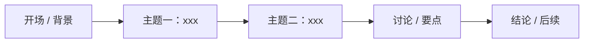

# A/V Notes

Turn any audio or video recording **or** raw text into a clean, decision-useful summary. Works for meetings, lectures, talks, podcasts, interviews, tutorials — any spoken content. Work in two stages: get text first (transcribe if needed), then structure it.

## 1. Audio → Text (only if the user gave an audio/video file)

If the input is already text, **skip this stage**. Otherwise get the transcript in this order:

**Preferred — 飞书妙记 (`lark-minutes`).** If a `lark-minutes` skill is available, use it to transcribe the audio (it handles local audio → transcript directly). This is the default path when the skill exists.

**Fallback — local transcription.** Use the built-in [scripts/transcribe.py](scripts/transcribe.py) (SenseVoice on sherpa-onnx, CPU-only, no PyTorch) **only when** either:
- no `lark-minutes` skill is available, or
- `lark-minutes` runs but reports insufficient quota / 额度不够 (or otherwise fails).

> [!IMPORTANT]
> Fallback assumes a CPU-only machine in a China network environment: install from the Tsinghua PyPI mirror, and the int8 model (~229MB) auto-downloads from ModelScope (`poloniumrock/SenseVoiceSmallOnnx`), not HuggingFace.

```bash
pip install sherpa-onnx modelscope -i https://pypi.tuna.tsinghua.edu.cn/simple
# ffmpeg decodes mp3/m4a/etc. — check first, only install if missing (skip for 16k mono wav):
#   command -v ffmpeg || brew install ffmpeg      # macOS
#   command -v ffmpeg || sudo apt install ffmpeg  # Linux

# transcribe (CPU; model auto-downloads on first run)
python scripts/transcribe.py recording.m4a --out transcript.txt
# long recording? add VAD segmentation:
#   wget https://github.com/k2-fsa/sherpa-onnx/releases/download/asr-models/silero_vad.onnx
#   python scripts/transcribe.py recording.m4a --vad silero_vad.onnx --out transcript.txt
# force a language: --lang zh   |   more CPU threads: --num-threads 8
```

**Video input.** If the file is a video (`.mp4/.mov/...`), pass it to the same script — it transcribes the audio track **and, in parallel, grabs 10 key frames + reads video info** (via ffmpeg/ffprobe) in the *same run*, so the frames cost almost no extra time (they overlap the slow transcription).

```bash
python scripts/transcribe.py recording.mp4 --out transcript.txt
# → transcript.txt, plus 10 frames in ./transcript_frames/ ; stderr prints
#   [video-info] {...}  and  [video-frames] [...]
# tweak: --frames-dir DIR   |   --no-frames  skip
```

Frames are emitted on stderr **as soon as they're ready — before transcription finishes**. Watch for these lines and start reading the frames right away (don't wait for the transcript):
- `[video-info] {...}` — printed first, right after probing.
- `[video-frames] [paths]` + `[video-frames-ready] N frames … safe to read now` — printed the moment extraction completes, while transcription is still running.

Use the frames and metadata as visual/context input when writing the notes in stage 2.

> [!IMPORTANT]
> **Transcription can be wrong** — ASR mishears names, terms, and numbers. When the transcript conflicts with what the video frames show (a name on a slide, a figure in a table, a date on screen), **trust the visual**.
> **Write only the correct value — silently.** Don't show both readings or annotate the fix. The reader wants the right answer, not the correction history.

Either path yields clean punctuated text — feed the result into stage 2.

## 2. Organize the Notes

**Write the final deliverable in Markdown by default** (a `.md` file / Markdown content) — it renders the flow diagram, bullets, and checkboxes natively. Only switch to another format when the user explicitly asks (see §3).

Adapt the shape to the content. Not everything is a meeting — a lecture has no attendees or action items, a podcast has no agenda. Include a part only when the source supports it; skip what doesn't fit. The four parts below, in order, are the default toolkit:

### 2.1 Header — info table

Open with a compact table of the recording's key facts, so a reader gets the essentials at a glance. Fill every field you can infer from the source; use `—` when truly unknown — don't invent.

```markdown
| 项目 | 内容 |
| --- | --- |
| 主题 | xxx |
| 类型 | 会议 / 讲座 / 播客 / 访谈 / … |
| 日期 / 时间 | yyyy-mm-dd HH:MM |
| 参与人 | 张三、李四、王五 |
| 目的 / 主旨 | xxx |
```

Adjust rows to fit the content (a meeting adds 主持人、缺席; a lecture adds 讲者、时长). Keep it to the truly important facts, not a form to fill.

### 2.2 Opening — content flow diagram

Start with a simple Mermaid `flowchart` showing the recording's rough flow / topics, so a reader grasps the structure at a glance.



### 2.3 Body — bulleted content

- Organize by topic/section; use bullets, not prose paragraphs. Each bullet is one point, decision, or key idea.
- Write to summary best practice: capture **outcomes, conclusions, and reasoning**, not a play-by-play transcript. Distill — don't narrate who said what turn by turn.
- **Never attribute lines to speakers** ("张三 说……", "李四 认为……"). Drop the speaker; keep the point. Name a specific person **only** when assigning an action item / owner (see §2.4), not when recording discussion.
- **Lose nothing of value.** Distilling means dropping filler and repetition, *not* dropping substance — every decision, action item, open question, risk, number, date, key argument, and agreed next step must survive into the notes. Concise ≠ incomplete: cut the words, keep the information.
- Bold the conclusions/key takeaways so they stand out from supporting detail.
- Keep it faithful to the source — summarize, don't fabricate. If something was unclear or inaudible, say so rather than guessing.

### 2.4 Ending — to-do list (**meeting minutes only**)

> [!IMPORTANT]
> A to-do list is **exclusive to the meeting-minutes scenario**. Generate it **only** when the recording is a meeting that produced concrete follow-ups. For every other type — lecture, talk, podcast, interview, tutorial, etc. — **do not generate a to-do list, and do not mention action items, owners, or due dates at all.** Omit the section entirely; don't leave a placeholder or an empty heading.

For a meeting, close with an actionable to-do list. Use checkboxes; include owner and due date when stated.

```markdown
## 后续待办 (To-Do)
- [ ] 任务描述 —— 负责人 @xxx —— 截止 mm/dd
- [ ] …
```

## 3. Customization

- **Transcription params** — language, CPU threads, VAD segmentation, and model dir are flags on [scripts/transcribe.py](scripts/transcribe.py) (`--lang`, `--num-threads`, `--vad`, `--model-dir`). To use a different SenseVoice ONNX model, point `--model-dir` at a folder holding `model.int8.onnx` + `tokens.txt`.
- **Video frames** — for video input the script grabs key frames + video info in parallel with transcription; tune with `--frames N`, `--frames-dir DIR`, or disable via `--no-frames`.
- **Report shape** — the default toolkit is info table → flow diagram → bullets, plus a to-do list **only for meeting minutes**; drop parts that don't fit the content, and adjust section headings or language to match the user's conventions.

> **Default output is Markdown.** Only when the user explicitly wants another formatted artifact (HTML, PDF, DOCX, Lark/Feishu doc) should you check available skills for one that produces that format and invoke it — don't hand-roll the file.
