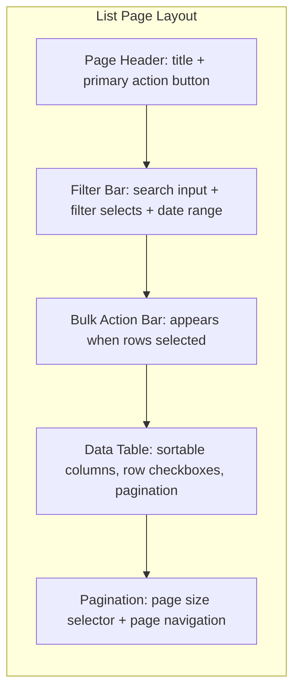

# Design System Specification

## 0. Relationship to Parent

This Skill inherits **all** constraints from `doc-writing-guide-v2`:

- Intent interpretation (SS1): purpose, audience, tone, scope, and constraint analysis.
- Genre & format selection (SS2): design system specs map to the "Technical Documentation" genre row — specifically the "Specification" sub-type.
- Language to avoid (SS3): no checklist-jargon, no empty superlatives, no formulaic stubs.
- Content structure principles (SS4): substance over format, no pre-imposed rigid outlines.
- Visual generation guide (SS5): token swatches, component diagrams, and page layout illustrations follow parent rules.
- Citation: design system specs are generally self-contained — do NOT add inline citations unless the user explicitly requests referencing external design systems (Ant Design, Tdesign, Material Design, etc.). When referencing a mature design system's practice, annotate `[Research-backed]`.

Anything defined below **extends** the parent; it never overrides.

---

## 1. Core Principles

1. **Token-first.** Define design variables (design tokens) first, compose them into components, then compose components into template pages. This bottom-up layering ensures every visual decision traces back to a named, documented token — never a hardcoded value. A component that uses `spacing-md` and `color-primary-500` is maintainable; a component that uses `16px` and `#1890ff` is not.
2. **Machine-readable.** The specification is a primary input for AI coding tools and frontend developers alike. Every token, component prop, and variant must be expressed in a structured, parseable format — tables for token inventories and prop lists, fenced code blocks for usage examples. Variable names must follow a deterministic naming convention with no spaces, no special characters, and no ambiguity.
3. **Semantic layer vs. visual layer separation.** Maintain two tiers of tokens: the **visual layer** (raw values like `color-primary-500: #1890ff`) and the **semantic layer** (role-based references like `color-brand: color-primary-500`). Components consume semantic tokens exclusively. When the brand color changes, only the semantic-to-visual mapping updates — no component code changes.
4. **Component self-documenting.** Each component specification is an executable contract: it carries its Props table (with types and defaults), its full state list, its variant list, and a runnable code example. A developer or AI tool reading the spec should be able to implement the component without consulting any external source.
5. **Consistent naming convention.** The entire document follows one unified naming system — `kebab-case` for all tokens and component CSS classes, `{category}-{role}-{shade}` for color tokens, `{category}-{size}` for spacing/radius/shadow tokens. This convention is portable across CSS custom properties, JavaScript objects, and Figma variable names without translation.

---

## 2. Workflow Overview

Execute the following steps in order:

```
Step 1: Requirement Recognition → §3 (classify across 5 dimensions)
Step 2: Structure Selection → §4 (match document type to structure pattern)
Step 3: Token Foundation → §5.1 Module 1 (define naming convention + all token categories)
Step 4: Component & Icon Specs → §5.1 Modules 2–3 (specify components, props, states, variants)
Step 5: Scenario Modules → §5.2 (add chart, template page, dark mode, Figma, a11y as needed)
Step 6: Evidence Annotation → §6 (tag every design decision)
Step 7: Quality Self-Check → §7 (verify 14 items)
```

---

## 3. Requirement Recognition (Five Dimensions)

On receiving a design system specification request, classify the input across these five dimensions before proceeding:

| Dimension | Classification Options |
|-----------|------------------------|
| **Document type** | Design Token library / Component library specification / Icon system / Chart & visualization specification / Complete design system (tokens + components + icons + templates) |
| **Target platform** | Web / Mobile (iOS + Android) / Cross-platform (Web + Mobile + Desktop) |
| **Tech stack** | React / Vue / Angular / Native CSS (custom properties) / Tailwind CSS / Figma-only (no code output) / Multi-framework |
| **Audience** | Frontend developers / Designers / AI coding tools / Cross-functional team (dev + design + PM) |
| **Complexity** | Quick reference (single page, token cheat-sheet) / Standard specification (5–15 pages, one subsystem) / Complete design system (20+ pages, full coverage) |

**Execution rule:** Present classification as a brief table to the user. Confirm correctness before proceeding. If uncertain about any dimension, state your inference rationale and ask the user to confirm or correct. Pay special attention to the **tech stack** dimension — it determines whether tokens are emitted as CSS custom properties, JavaScript/TypeScript objects, Tailwind config entries, or Figma variable definitions.

---

## 4. Structure Selection Matrix

Match the document type to its structure pattern. When the request is for a complete design system, merge all rows in dependency order: tokens first, then components, then icons, then charts, then template pages.

| Document Type | Structure Pattern | Mandatory Elements |
|---------------|-------------------|--------------------|
| **Design Token library** | Naming convention → Color system → Spacing system → Typography system → Shadow system → Radius system → Motion system → Dark mode mapping | Naming convention spec, per-category token tables (name, value, semantic, usage), dark-mode token mapping table |
| **Component library specification** | Component definition → Props API → States → Variants → Usage examples → Do / Don't | Component name + description, Props table (name, type, default, required, description), state list, variant list, ≥1 code example, Do/Don't guidance |
| **Icon system** | Icon inventory → Naming convention → Size specification → Style specification → Usage rules | Full icon name list, naming pattern, size scale table, style guidelines, usage code examples |
| **Chart & visualization specification** | Chart type catalog → Color palette → Data mapping rules → Interaction specification → Accessibility requirements | Supported chart type list, series color tokens, axis/legend/tooltip mapping rules, interaction states, color-contrast and screen-reader requirements |
| **Template page definition** | Page type catalog → Layout structure → Component composition → Responsive rules → Empty / loading / error states | Page type list with wireframe, component slot map, breakpoint table, state variants per page type |

**Routing rule:** Match the user's document type to the closest row. If the request is "write a complete design system", generate all rows in the dependency order listed above — tokens are always the foundation, components reference tokens, icons may reference color tokens, and template pages reference components. Never specify a component before its constituent tokens are defined.

---

## 5. Modular Template

Generate the specification using these modules. **Select, expand, or omit modules based on the structure selection result** — do not blindly include everything. However, Module 1 (Token Foundation) is always required when any other module is present, because every component, icon, and page references tokens.

### 5.1 Core Modules (always present)

#### Module 1: Design Token Foundation

This module defines the naming convention and all token categories. It is the single source of truth that every other module references.

##### 1.1 Naming Convention

State the naming convention explicitly before any token tables. The default convention:

| Token Category | Pattern | Example |
|----------------|---------|---------|
| Color (visual) | `color-{role}-{shade}` | `color-primary-500`, `color-success-100`, `color-neutral-700` |
| Color (semantic) | `color-{semantic-role}` | `color-brand`, `color-text-primary`, `color-bg-surface` |
| Spacing | `spacing-{size}` | `spacing-xs`, `spacing-sm`, `spacing-md`, `spacing-lg`, `spacing-xl` |
| Font family | `font-family-{role}` | `font-family-sans`, `font-family-mono` |
| Font size | `font-size-{scale}` | `font-size-sm`, `font-size-md`, `font-size-lg` |
| Font weight | `font-weight-{name}` | `font-weight-regular`, `font-weight-medium`, `font-weight-bold` |
| Line height | `font-lineHeight-{scale}` | `font-lineHeight-tight`, `font-lineHeight-normal`, `font-lineHeight-relaxed` |
| Radius | `radius-{size}` | `radius-sm`, `radius-md`, `radius-lg`, `radius-full` |
| Shadow | `shadow-{level}` | `shadow-sm`, `shadow-md`, `shadow-lg`, `shadow-xl` |
| Motion duration | `motion-duration-{speed}` | `motion-duration-fast`, `motion-duration-normal`, `motion-duration-slow` |
| Motion easing | `motion-easing-{name}` | `motion-easing-ease-in`, `motion-easing-ease-out`, `motion-easing-spring` |
| Z-index | `z-index-{layer}` | `z-index-dropdown`, `z-index-modal`, `z-index-toast` |
| Component prefix | `{component}-{property}` | `btn-bg`, `input-border`, `card-shadow` |

> **Naming rule:** All tokens use `kebab-case`. No camelCase, no snake_case, no spaces. Token names must be valid CSS custom property names (after `--` prefix) and valid JavaScript object keys. This ensures the same token name works in `--color-primary-500: #1890ff`, `tokens.color.primary500`, and Figma's `color/primary/500` without translation logic.

##### 1.2 Color System

Present color tokens in two tiers — visual layer (raw values) and semantic layer (role-based references). Both tiers are tables.

**Visual Layer — Color Palette**

| Token Name | Value | Shade Label | Usage Scenario |
|------------|-------|-------------|----------------|
| `color-primary-50` | `#e6f7ff` | Lightest | Primary-tinted backgrounds, hover states for primary elements |
| `color-primary-100` | `#bae7ff` | Lighter | Primary-tinted borders, selection highlights |
| `color-primary-500` | `#1890ff` | Base | Primary buttons, active navigation, links |
| `color-primary-600` | `#096dd9` | Dark | Primary button hover |
| `color-primary-700` | `#0050b3` | Darker | Primary button active/pressed |
| `color-success-500` | `#52c41a` | Base | Success messages, confirmation indicators |
| `color-warning-500` | `#faad14` | Base | Warning messages, caution indicators |
| `color-error-500` | `#ff4d4f` | Base | Error messages, destructive actions |
| `color-neutral-50` | `#fafafa` | Lightest | Page backgrounds |
| `color-neutral-100` | `#f5f5f5` | Lighter | Card backgrounds, subtle surfaces |
| `color-neutral-500` | `#bfbfbf` | Base | Disabled states, dividers |
| `color-neutral-700` | `#262626` | Dark | Body text |

> Color values shown above reference common Ant Design palette conventions `[Research-backed]`. If the user provides their own brand palette, use those values instead and annotate `[Data-backed]`. Do not fabricate hex values — every color must trace to either the user's input or a cited mature design system.

**Semantic Layer — Role Tokens**

| Token Name | References | Usage Scenario |
|------------|-----------|----------------|
| `color-brand` | `color-primary-500` | Brand-identifying elements: logo, primary CTAs, active nav |
| `color-brand-hover` | `color-primary-600` | Hover state of brand-colored elements |
| `color-brand-active` | `color-primary-700` | Active/pressed state of brand-colored elements |
| `color-text-primary` | `color-neutral-700` | Body text, headings |
| `color-text-secondary` | `color-neutral-500` | Captions, helper text, placeholders |
| `color-text-inverse` | `#ffffff` | Text on dark/colored backgrounds |
| `color-bg-page` | `color-neutral-50` | Application page background |
| `color-bg-surface` | `#ffffff` | Card, modal, popover backgrounds |
| `color-bg-subtle` | `color-neutral-100` | Section backgrounds within cards |
| `color-border-default` | `color-neutral-100` | Default borders, dividers |
| `color-border-focus` | `color-primary-500` | Focus rings, active input borders |
| `color-feedback-success` | `color-success-500` | Success toasts, validation pass indicators |
| `color-feedback-warning` | `color-warning-500` | Warning toasts, validation caution indicators |
| `color-feedback-error` | `color-error-500` | Error toasts, validation fail indicators |

> **Semantic-to-visual rule:** Semantic tokens MUST reference visual tokens by name — never hardcode a hex value directly in a semantic token. This is what makes theme switching possible: changing the visual palette automatically updates all semantic mappings.

##### 1.3 Spacing System

| Token Name | Value | Usage Scenario |
|------------|-------|----------------|
| `spacing-xs` | `4px` | Icon-to-label gaps, tight inline spacing |
| `spacing-sm` | `8px` | Compact padding, form field internal spacing |
| `spacing-md` | `16px` | Default card padding, list item gaps, form field vertical rhythm |
| `spacing-lg` | `24px` | Section internal padding, card-to-card gaps |
| `spacing-xl` | `32px` | Section-to-section gaps, page-level margins |
| `spacing-2xl` | `48px` | Major layout divisions, hero section spacing |

> Spacing scale uses a base-4 grid (4, 8, 16, 24, 32, 48) following the 8pt grid system convention `[Research-backed]`. If the user specifies a different base unit (e.g., 5px or 10px), adjust the scale and annotate `[Expert judgment]`.

##### 1.4 Typography System

| Token Name | Value | Usage Scenario |
|------------|-------|----------------|
| `font-family-sans` | `'Inter', -apple-system, BlinkMacSystemFont, 'Segoe UI', sans-serif` | Body text, UI labels, all default text |
| `font-family-mono` | `'JetBrains Mono', 'Fira Code', 'Courier New', monospace` | Code blocks, numeric data in tables |
| `font-size-xs` | `12px` | Captions, badges, helper text |
| `font-size-sm` | `14px` | Secondary text, table cell text, form labels |
| `font-size-md` | `16px` | Body text, button labels, input text |
| `font-size-lg` | `20px` | Subheadings, card titles |
| `font-size-xl` | `24px` | Page section headings |
| `font-size-2xl` | `32px` | Page titles, hero headings |
| `font-weight-regular` | `400` | Body text |
| `font-weight-medium` | `500` | Labels, table headers, emphasis |
| `font-weight-bold` | `700` | Headings, button labels |
| `font-lineHeight-tight` | `1.25` | Headings, dense data displays |
| `font-lineHeight-normal` | `1.5` | Body text, paragraphs |
| `font-lineHeight-relaxed` | `1.75` | Long-form reading, help text |

##### 1.5 Shadow System

| Token Name | Value | Usage Scenario |
|------------|-------|----------------|
| `shadow-sm` | `0 1px 2px 0 rgba(0, 0, 0, 0.05)` | Cards at rest, subtle elevation |
| `shadow-md` | `0 4px 6px -1px rgba(0, 0, 0, 0.1), 0 2px 4px -1px rgba(0, 0, 0, 0.06)` | Dropdowns, popovers, hover elevation |
| `shadow-lg` | `0 10px 15px -3px rgba(0, 0, 0, 0.1), 0 4px 6px -2px rgba(0, 0, 0, 0.05)` | Modals, floating panels |
| `shadow-xl` | `0 20px 25px -5px rgba(0, 0, 0, 0.1), 0 10px 10px -5px rgba(0, 0, 0, 0.04)` | Full-screen overlays, drag previews |

##### 1.6 Radius System

| Token Name | Value | Usage Scenario |
|------------|-------|----------------|
| `radius-sm` | `4px` | Buttons, inputs, small UI elements |
| `radius-md` | `8px` | Cards, modals, panels |
| `radius-lg` | `12px` | Large cards, feature containers |
| `radius-full` | `9999px` | Avatars, pills, circular elements |

##### 1.7 Token Output Format

Specify how tokens are emitted for the target tech stack. Provide at least one concrete output block.

**CSS Custom Properties output:**

```css
:root {
  /* Color — Visual Layer */
  --color-primary-500: #1890ff;
  --color-primary-600: #096dd9;

  /* Color — Semantic Layer */
  --color-brand: var(--color-primary-500);
  --color-brand-hover: var(--color-primary-600);

  /* Spacing */
  --spacing-xs: 4px;
  --spacing-md: 16px;

  /* Typography */
  --font-size-md: 16px;
  --font-weight-bold: 700;
}
```

**JavaScript/TypeScript token object output:**

```typescript
export const tokens = {
  color: {
    primary: { 500: '#1890ff', 600: '#096dd9' },
    brand: 'var(--color-primary-500)',
    brandHover: 'var(--color-primary-600)',
  },
  spacing: { xs: '4px', md: '16px' },
  fontSize: { md: '16px' },
} as const;
```

> If the tech stack is Tailwind CSS, also provide the `tailwind.config.js` extension snippet. If the tech stack is Figma-only, describe the Figma Variables structure (collection → mode → variable name → value).

#### Module 2: Component Specification

Each component in the library gets its own specification block. A component spec is an executable contract — it must contain all six elements below.

##### Component Spec Template

For each component, produce the following structure:

```markdown
### {ComponentName}

**Description:** One-sentence summary of what the component does and when to use it.

#### Props

| Prop Name | Type | Default | Required | Description |
|-----------|------|---------|----------|-------------|
| `variant` | `'primary' \| 'secondary' \| 'ghost' \| 'danger'` | `'primary'` | No | Visual variant of the component |
| `size` | `'sm' \| 'md' \| 'lg'` | `'md'` | No | Controls height, padding, and font-size |
| `disabled` | `boolean` | `false` | No | Disables interaction and applies disabled styles |
| `loading` | `boolean` | `false` | No | Shows a loading spinner and disables interaction |
| `onClick` | `(event: MouseEvent) => void` | — | No | Click handler |

#### States

| State | Visual Description | Trigger |
|-------|-------------------|---------|
| Default | Resting appearance — uses `color-brand` background | No interaction |
| Hover | Elevated appearance — uses `color-brand-hover` | Mouse pointer enters |
| Active/Pressed | Depressed appearance — uses `color-brand-active` | Mouse down |
| Focus | Visible focus ring — uses `color-border-focus` with `2px` outline | Keyboard navigation or click |
| Disabled | Reduced opacity (`opacity: 0.5`), `cursor: not-allowed` | `disabled` prop is `true` |
| Loading | Spinner replaces content, pointer events disabled | `loading` prop is `true` |

#### Variants

| Variant | Token Usage | When to Use |
|---------|-------------|-------------|
| `primary` | `bg: color-brand`, `text: color-text-inverse` | Main call-to-action |
| `secondary` | `bg: color-bg-surface`, `border: color-border-default`, `text: color-text-primary` | Alternative actions, secondary CTAs |
| `ghost` | `bg: transparent`, `text: color-brand` | Tertiary actions in dense layouts |
| `danger` | `bg: color-feedback-error`, `text: color-text-inverse` | Destructive actions (delete, remove) |

#### Usage Example

(code block in the component's target framework)

#### Do / Don't

- Do use `primary` variant for the single most important action on the page.
- Don't use `danger` variant for non-destructive actions — it trains users to ignore the warning signal.
- Don't place two `primary` buttons side by side; use `primary` + `secondary` to establish hierarchy.
```

##### Worked Example — Button Component

**Description:** A versatile button component for triggering actions, with support for variants, sizes, and loading states.

#### Props

| Prop Name | Type | Default | Required | Description |
|-----------|------|---------|----------|-------------|
| `variant` | `'primary' \| 'secondary' \| 'ghost' \| 'danger'` | `'primary'` | No | Visual variant |
| `size` | `'sm' \| 'md' \| 'lg'` | `'md'` | No | Size scale |
| `disabled` | `boolean` | `false` | No | Disables interaction |
| `loading` | `boolean` | `false` | No | Shows spinner, disables interaction |
| `icon` | `ReactNode \| null` | `null` | No | Optional leading icon |
| `onClick` | `(event: MouseEvent) => void` | — | No | Click handler |
| `children` | `ReactNode` | — | Yes | Button label content |

#### States

| State | Visual Description | Trigger |
|-------|-------------------|---------|
| Default | `color-brand` background, `color-text-inverse` text | Resting |
| Hover | `color-brand-hover` background | Mouse enter |
| Active | `color-brand-active` background | Mouse down |
| Focus | `2px` outline using `color-border-focus`, `2px` offset | Keyboard tab |
| Disabled | `opacity: 0.5`, `cursor: not-allowed` | `disabled = true` |
| Loading | Spinner icon, `pointer-events: none` | `loading = true` |

#### Variants

| Variant | Background | Text | Border | Use For |
|---------|-----------|------|--------|---------|
| `primary` | `color-brand` | `color-text-inverse` | none | Primary CTA |
| `secondary` | `color-bg-surface` | `color-text-primary` | `1px solid color-border-default` | Secondary actions |
| `ghost` | `transparent` | `color-brand` | none | Tertiary actions |
| `danger` | `color-feedback-error` | `color-text-inverse` | none | Destructive actions |

#### Size Mapping

| Size | Height | Padding (horizontal) | Font Size | Icon Size |
|------|--------|---------------------|-----------|-----------|
| `sm` | `28px` | `spacing-sm` | `font-size-sm` | `14px` |
| `md` | `36px` | `spacing-md` | `font-size-md` | `16px` |
| `lg` | `44px` | `spacing-lg` | `font-size-lg` | `20px` |

#### Usage Example (React)

```jsx
<Button variant="primary" size="md" onClick={handleSave}>
  Save Changes
</Button>

<Button variant="danger" size="md" loading={isDeleting} onClick={handleDelete}>
  Delete Project
</Button>

<Button variant="ghost" size="sm" icon={<IconPlus />} onClick={handleAdd}>
  Add Item
</Button>
```

#### Do / Don't

- Do use `primary` for the single most important action per section.
- Don't use more than one `primary` button in the same visual group.
- Don't use `danger` for non-destructive actions.
- Do pair `loading` with async actions to give immediate feedback.

> Repeat this spec structure for every component in the library. Common components to cover: Button, Input, Select, Checkbox, Radio, Switch, Table, Card, Modal, Drawer, Toast, Tooltip, Tabs, Breadcrumb, Pagination, Avatar, Badge, Tag, Alert, Empty State, Skeleton, Form Layout.

#### Module 3: Icon System

##### 3.1 Naming Convention

| Rule | Pattern | Example |
|------|---------|---------|
| Icon name | `{category}-{name}` | `action-save`, `navigation-menu`, `status-success` |
| Category prefix | `action` / `navigation` / `status` / `media` / `content` / `communication` / `editor` / `system` | `action-edit`, `media-play`, `communication-mail` |
| Naming style | `kebab-case`, no size or color in the name | `action-delete` (not `action-delete-16px-red`) |

> Icon names must not encode size, color, or variant — those are runtime properties. An icon named `action-delete-16-red` violates the convention; `action-delete` is correct.

##### 3.2 Icon Inventory

Provide a complete catalog table. Every icon in the system is listed here — no icon is used in the UI that is not in this table.

| Icon Name | Category | Description | Tags |
|-----------|----------|-------------|------|
| `action-add` | action | Plus sign, used for "create" actions | create, new, plus |
| `action-edit` | action | Pencil, used for "edit" actions | edit, pencil, modify |
| `action-delete` | action | Trash can, used for "delete" actions | delete, trash, remove |
| `action-save` | action | Floppy disk, used for "save" actions | save, store, disk |
| `action-search` | action | Magnifying glass, used for search | search, find, magnify |
| `navigation-menu` | navigation | Hamburger menu | menu, hamburger, sidebar |
| `navigation-close` | navigation | X mark, used for close/dismiss | close, x, dismiss |
| `navigation-chevron-right` | navigation | Right-pointing chevron | next, expand, forward |
| `status-success` | status | Checkmark in circle | success, check, done |
| `status-warning` | status | Triangle with exclamation | warning, caution, alert |
| `status-error` | status | Circle with X | error, fail, danger |
| `status-info` | status | Circle with i | info, information, help |

> The inventory above is illustrative. The actual icon set must match the user's product — do not fabricate icons that the product does not need. If the user provides an icon list, use it directly and tag `[Data-backed]`.

##### 3.3 Size Specification

| Size Token | Pixel Value | Usage Scenario |
|------------|-------------|----------------|
| `icon-size-xs` | `12px` | Inline icons within text, badges |
| `icon-size-sm` | `14px` | Small buttons, form field adornments |
| `icon-size-md` | `16px` | Default button icons, navigation items |
| `icon-size-lg` | `20px` | Large buttons, card header icons |
| `icon-size-xl` | `24px` | Empty state illustrations, feature highlights |

##### 3.4 Style Specification

| Property | Specification |
|----------|--------------|
| Stroke width | `1.5px` for outlined style, `2px` for small icons (≤16px) to maintain visibility |
| Fill style | Outline (stroked) by default; filled variants only for active/selected states |
| Corner radius | `1px` rounded corners on rectangular shapes |
| Viewbox | `24x24` standard viewbox for all icons; artwork drawn on a 20x20 grid with 2px padding |
| Color | Icons inherit `currentColor` — never hardcode fill colors in the SVG |

##### 3.5 Usage Example

```jsx
<Icon name="action-search" size="md" color="color-text-secondary" />
```

### 5.2 Scenario-Triggered Modules

Include these modules when the requirement recognition (§3) or structure selection (§4) indicates they are in scope.

#### Module 4: Chart & Visualization Specification

##### 4.1 Chart Type Catalog

| Chart Type | When to Use | Supported Series |
|------------|-------------|-----------------|
| Line chart | Trend over time | Single or multi-series |
| Bar chart (vertical) | Magnitude comparison across categories | Single or grouped |
| Bar chart (horizontal) | Category comparison with long labels | Single or grouped |
| Pie / Donut | Part-to-whole (≤6 segments) | Single series |
| Scatter | Correlation between two variables | Multi-point |
| Area chart | Cumulative volume over time | Single or stacked |
| Heatmap | Density across two dimensions | Grid data |

##### 4.2 Chart Color Palette

Chart series colors must use dedicated chart tokens, not generic UI color tokens, because charts need distinct hues for series differentiation while UI elements need semantic consistency.

| Token Name | Value | Series Position |
|------------|-------|-----------------|
| `chart-color-1` | `#5B8FF9` | Primary series |
| `chart-color-2` | `#5AD8A6` | Secondary series |
| `chart-color-3` | `#5D7092` | Tertiary series |
| `chart-color-4` | `#F6BD16` | Quaternary series |
| `chart-color-5` | `#E8684A` | Fifth series |
| `chart-color-6` | `#6DC8EC` | Sixth series |

> Chart palette references Ant Design Charts (AntV) default series colors `[Research-backed]`. If the user specifies a different visualization library (ECharts, Chart.js, Recharts), adapt the palette to that library's conventions and annotate the source.

##### 4.3 Data Mapping Rules

| Chart Element | Token / Rule | Description |
|---------------|-------------|-------------|
| Axis line | `color-border-default` | Subtle axis lines using border token |
| Axis label | `color-text-secondary`, `font-size-xs` | Secondary text color, small size |
| Grid line | `rgba(0, 0, 0, 0.04)` | Barely visible horizontal grid lines |
| Series color | `chart-color-{n}` | Cycled from the chart palette by series index |
| Tooltip background | `color-bg-surface` | Solid surface background |
| Tooltip text | `color-text-primary`, `font-size-sm` | Primary text, small size |
| Legend text | `color-text-secondary`, `font-size-sm` | Secondary text, small size |

##### 4.4 Interaction Specification

| Interaction | Behavior |
|-------------|---------|
| Hover on data point | Highlight point, show tooltip with exact value |
| Hover on legend item | Dim non-corresponding series to `opacity: 0.2` |
| Click on legend item | Toggle series visibility (show/hide) |
| Brush selection | Zoom into selected range (line/area charts only) |

##### 4.5 Accessibility Requirements

| Requirement | Specification |
|-------------|--------------|
| Color contrast | Adjacent series colors must have ≥ 3:1 contrast ratio (WCAG 1.4.11 non-text contrast) |
| Color blindness | Do not rely on color alone — use patterns, labels, or direct value annotation as redundant cues |
| Screen reader | Each chart must have an `aria-label` summarizing the chart type and key finding; data tables should be available as an alternative view |
| Keyboard | Legend items must be focusable and operable via keyboard (Enter to toggle) |

#### Module 5: Template Page Definition

Template pages define how components compose into full-page layouts. Each page type gets its own spec.

##### Page Type Catalog

| Page Type | Description | Key Components |
|-----------|-------------|----------------|
| List page | Data-dense listing with filters and bulk actions | Table, Filter bar, Pagination, Bulk action bar |
| Detail page | Single-record view with tabbed sections | Card, Tabs, Description list, Action buttons |
| Form page | Data entry with validation and submit | Form layout, Input, Select, Validation messages, Submit bar |
| Dashboard | Overview with KPIs and charts | KPI card, Chart container, Grid layout |
| Empty state | First-use or no-data state | Empty illustration, Primary CTA, Help link |
| Error page | 404, 500, or permission denied | Error illustration, Recovery actions |

##### Template Spec Structure (per page type)

For each page type, provide:

1. **Wireframe** — a Mermaid or ASCII layout diagram showing the spatial arrangement of regions.
2. **Component slot map** — a table listing each region, the component that fills it, and its token references.
3. **Responsive rules** — breakpoint table showing how the layout adapts.
4. **State variants** — how the page looks in empty, loading, and error states.

**Worked Example — List Page:**



| Region | Component | Key Tokens |
|--------|-----------|------------|
| Page header | `<PageHeader>` | `spacing-md` padding, `font-size-xl` title, `spacing-lg` bottom margin |
| Filter bar | `<FilterBar>` | `color-bg-subtle` background, `spacing-sm` internal padding, `radius-md` |
| Bulk action bar | `<BulkActionBar>` | `color-brand` background, `color-text-inverse` text, `shadow-md` |
| Data table | `<Table>` | `color-bg-surface` background, `color-border-default` row separators |
| Pagination | `<Pagination>` | `spacing-md` top margin, right-aligned |

| Breakpoint | Min Width | Layout Behavior |
|------------|-----------|-----------------|
| Mobile | `0px` | Filter bar collapses into a drawer; table shows 2 columns + "view details" link; pagination becomes "load more" |
| Tablet | `768px` | Filter bar wraps to 2 rows; table shows 4 columns; full pagination |
| Desktop | `1200px` | Full filter bar inline; table shows all columns; full pagination with page size selector |

| State | Display |
|-------|---------|
| Empty | `<EmptyState>` with relevant illustration, "No data yet" message, and primary CTA to create first record |
| Loading | `<Skeleton>` rows matching table column count, `animation: pulse` |
| Error | `<ErrorState>` with error message, "Retry" button, and support contact link |

> Repeat this template spec for every page type in the catalog. The page types listed above are the minimum set for a standard web application `[Expert judgment]` — add or remove based on the user's product context.

#### Module 6: Dark Mode & Theme Switching

##### 6.1 Dark Mode Token Mapping

Provide a mapping table showing how each semantic token changes in dark mode. Visual layer tokens remain the same; only the semantic-to-visual references change.

| Semantic Token | Light Mode Reference | Dark Mode Reference |
|---------------|---------------------|---------------------|
| `color-text-primary` | `color-neutral-700` | `color-neutral-50` |
| `color-text-secondary` | `color-neutral-500` | `color-neutral-100` |
| `color-text-inverse` | `#ffffff` | `color-neutral-900` |
| `color-bg-page` | `color-neutral-50` | `#0d1117` |
| `color-bg-surface` | `#ffffff` | `#161b22` |
| `color-bg-subtle` | `color-neutral-100` | `#21262d` |
| `color-border-default` | `color-neutral-100` | `color-neutral-700` |
| `color-border-focus` | `color-primary-500` | `color-primary-400` |
| `color-brand` | `color-primary-500` | `color-primary-400` |

##### 6.2 Theme Switching Implementation

```css
:root {
  /* Light theme (default) */
  --color-text-primary: var(--color-neutral-700);
  --color-bg-page: var(--color-neutral-50);
  --color-bg-surface: #ffffff;
}

[data-theme='dark'] {
  /* Dark theme overrides */
  --color-text-primary: var(--color-neutral-50);
  --color-bg-page: #0d1117;
  --color-bg-surface: #161b22;
}
```

> Dark mode hex values for backgrounds (`#0d1117`, `#161b22`, `#21262d`) reference GitHub's dark theme palette `[Research-backed]`. If the user has a brand-specific dark palette, use those values and annotate `[Data-backed]`.

##### 6.3 Shadow Adjustment

Dark mode shadows should be darker and more subtle than light mode, as elevated surfaces are distinguished by lighter background rather than shadow.

| Shadow Token | Light Mode Value | Dark Mode Value |
|-------------|-----------------|-----------------|
| `shadow-sm` | `0 1px 2px 0 rgba(0, 0, 0, 0.05)` | `0 1px 2px 0 rgba(0, 0, 0, 0.3)` |
| `shadow-md` | `0 4px 6px -1px rgba(0, 0, 0, 0.1)` | `0 4px 6px -1px rgba(0, 0, 0, 0.4)` |

#### Module 7: Figma Page Organization Strategy

When the design system is maintained in Figma, document the file organization strategy so designers and developers can navigate consistently.

##### 7.1 File / Page Structure

| Figma Page | Contents | Audience |
|------------|----------|----------|
| `01 — Foundations` | Color styles, text styles, effect styles, grid templates | Designers, developers (token reference) |
| `02 — Icons` | All icon components organized by category | Designers, developers |
| `03 — Components` | Component library, organized by category (Buttons, Forms, Navigation, etc.) | Designers |
| `04 — Patterns` | Reusable component compositions (form patterns, card layouts, table patterns) | Designers |
| `05 — Templates` | Full-page template designs | Designers, PM |
| `06 — Documentation` | Usage guidelines, Do/Don't examples, annotation frames | All |

##### 7.2 Component Organization Rules

| Rule | Specification |
|------|--------------|
| Component naming | `{Category} / {ComponentName} / {Variant}` — e.g., `Buttons / Button / Primary` |
| Variant properties | Use Figma variant properties matching the code Props (e.g., `variant`, `size`, `state`) |
| Auto layout | All components must use Auto Layout with padding matching spacing tokens |
| Token binding | Color styles and effect styles in Figma must be named identically to the token names (e.g., `color-primary-500`, `shadow-md`) |

#### Module 8: Accessibility (a11y) Specification

##### 8.1 Color Contrast Requirements

| Element Type | Minimum Contrast Ratio | Standard |
|-------------|----------------------|----------|
| Body text (< 18px) | 4.5:1 | WCAG 2.1 AA |
| Large text (≥ 18px or ≥ 14px bold) | 3:1 | WCAG 2.1 AA |
| UI components (borders, icons) | 3:1 | WCAG 2.1 AA |
| Non-text content (charts, diagrams) | 3:1 adjacent elements | WCAG 2.1 AA |
| Body text (enhanced) | 7:1 | WCAG 2.1 AAA |

##### 8.2 Focus Management

| Requirement | Specification |
|-------------|--------------|
| Focus indicator | `2px` solid outline using `color-border-focus`, with `2px` offset from element boundary |
| Focus visibility | Focus indicator must never be removed without an accessible alternative |
| Focus order | Tab order must follow visual reading order (top-to-bottom, left-to-right) |
| Keyboard trap | No keyboard traps — users must always be able to navigate away from any component via keyboard |

##### 8.3 Semantic HTML & ARIA

| Component | Required ARIA |
|-----------|--------------|
| Button | `aria-label` if no text content; `aria-disabled` when disabled |
| Modal | `role="dialog"`, `aria-modal="true"`, focus trap active while open |
| Toast | `role="status"` for non-critical, `role="alert"` for critical |
| Tooltip | `aria-describedby` on trigger element pointing to tooltip content |
| Tab list | `role="tablist"`, `role="tab"`, `role="tabpanel"`, `aria-selected` |
| Loading state | `aria-busy="true"` on the loading container |

> Contrast ratios reference WCAG 2.1 Level AA criteria `[Research-backed]`. If the user's product targets specific regulations (e.g., Section 508, EN 301 549), note the applicable standard and annotate accordingly.

---

## 6. Evidence Annotation System

Every design decision in the specification must be tagged so reviewers can distinguish established conventions from product-specific choices. Use these four labels inline, immediately after the claim:

| Label | Meaning | Example Usage |
|-------|---------|---------------|
| `[Data-backed]` | Supported by data the user provided (existing brand palette, analytics, user research) | "The primary brand color is `#1890ff` `[Data-backed]`" |
| `[Research-backed]` | Supported by external research, a cited mature design system, or an established standard | "Spacing uses an 8pt base grid `[Research-backed]`"; "Contrast ratios follow WCAG 2.1 AA `[Research-backed]`" |
| `[Expert judgment]` | Inferred from design expertise or convention, not independently verified | "Six chart series colors are sufficient for most dashboards `[Expert judgment]`" |
| `[Hypothesis]` | An assumption made to fill an information gap; must be confirmed before implementation | "Dark mode background `#0d1117` may need adjustment for OLED screens `[Hypothesis]`" |

**Rules:**

- When referencing a mature design system's practice (Ant Design, TDesign, Material Design, Carbon, GitHub Primer, Tailwind), annotate `[Research-backed]` and name the source system.
- When making a design decision based on experience or convention without a specific cited source, annotate `[Expert judgment]`.
- Never present a `[Hypothesis]` or `[Expert judgment]` claim as an established standard.
- When a design decision's evidence tier is unclear, default to `[Hypothesis]` and flag it for user confirmation.
- Color values, spacing values, and other concrete numbers must always be either user-provided (`[Data-backed]`) or sourced from a named design system (`[Research-backed]`) — never fabricated and presented as fact.

---

## 7. Quality Self-Check

After generation, verify every item internally. If any item does not pass, revise the specification until it passes. Do NOT include the self-check table or results in the final deliverable — this checklist is for internal quality assurance only.

| # | Check Item | Pass Criteria |
|---|-----------|---------------|
| 1 | **Naming convention is consistent** | All tokens across every category follow the same naming pattern (`kebab-case`, `{category}-{role}-{shade}`); no camelCase, snake_case, or spaces in any token name |
| 2 | **Token completeness** | Color, spacing, typography, shadow, and radius categories all have defined token tables; none is missing |
| 3 | **Component spec completeness** | Every component has all six elements: description, Props table, states list, variants list, usage code example, Do/Don't guidance |
| 4 | **Props have types and defaults** | Every prop in every Props table has a type definition and a default value (or explicitly marked as required with no default) |
| 5 | **Icon inventory is complete** | Icon catalog lists every icon with name, category, description, and tags; naming convention is documented; size and style specs are present |
| 6 | **Semantic layer references visual layer** | Every semantic token references a visual token by name — no semantic token hardcodes a hex value directly |
| 7 | **Dark mode is covered** | Dark mode token mapping table is present (if applicable to target platform); semantic tokens have both light and dark references |
| 8 | **Accessibility is covered** | Color contrast requirements, focus management rules, and ARIA patterns are documented; contrast ratios reference WCAG 2.1 |
| 9 | **Tokens are machine-readable** | Token tables use structured format (name, value, usage); at least one output format (CSS custom properties or JS/TS object) is provided as a code block |
| 10 | **Variable names are code-safe** | Every token name is a valid CSS custom property name and valid JavaScript identifier; no spaces, no special characters (except hyphens) |
| 11 | **Template pages cover main scenarios** | Page type catalog includes at minimum: list page, detail/form page, dashboard, empty state, error page (adjusted to product context) |
| 12 | **Figma strategy is clear** | If Figma is in the tech stack, page organization, component naming, and token binding rules are documented |
| 13 | **No fabricated values** | All color hex values, spacing numbers, and font sizes trace to either user input (`[Data-backed]`) or a cited design system (`[Research-backed]`); no invented values |
| 14 | **Depth matches complexity** | A quick-reference token cheat-sheet is not 20 pages; a complete design system is not a single page — depth aligns with the complexity tier from §3 |

---

## 8. Red-Line Rules

1. **Do not fabricate design system values.** Color hex values, spacing numbers, font sizes, and shadow definitions must come from the user's input or a named, cited mature design system. If a value cannot be sourced, mark it `[Hypothesis — confirmation pending]` and flag it for user review. Never invent a hex code and present it as an established standard.
2. **Variable names must be directly usable in code.** Every token name must be a valid CSS custom property name (after `--` prefix) and a valid JavaScript object key. No spaces, no special characters except hyphens, no reserved words. A token named `color primary 500` is a violation; `color-primary-500` is correct.
3. **Semantic tokens must reference visual tokens, not hardcoded values.** A semantic token like `color-brand` must be defined as `var(--color-primary-500)` or an equivalent reference — never as `#1890ff` directly. This separation is what makes theming and dark mode possible without touching component code.
4. **Component Props must have type definitions and defaults.** Every prop in a component spec must declare its type (union, primitive, callback), its default value (or `required` with no default), and a description. A Props table without types is not machine-readable and violates the self-documenting component principle.
5. **Do not omit dark mode or accessibility coverage when applicable.** If the target platform supports theme switching, dark mode token mappings must be present. Accessibility requirements (contrast ratios, focus management, ARIA patterns) must be documented for all interactive components. Omitting these is a compliance gap, not a concision win.

---
