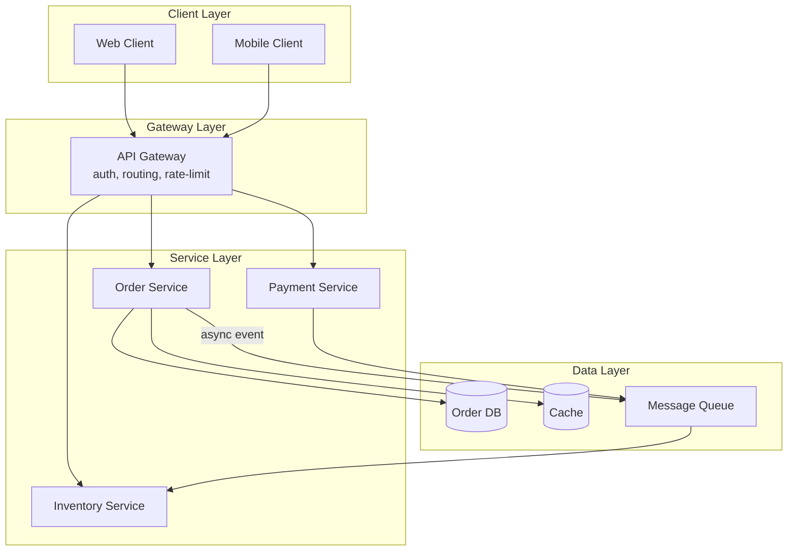
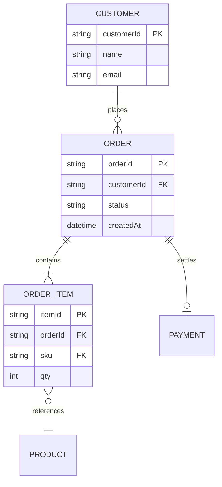
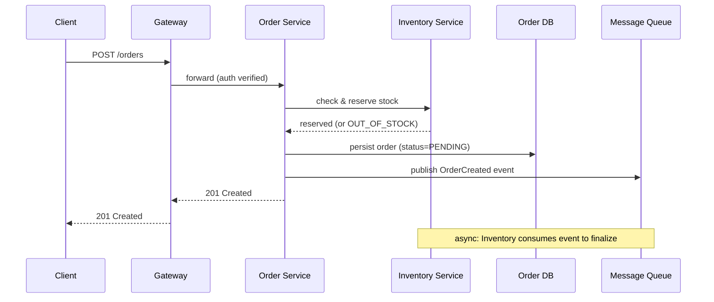
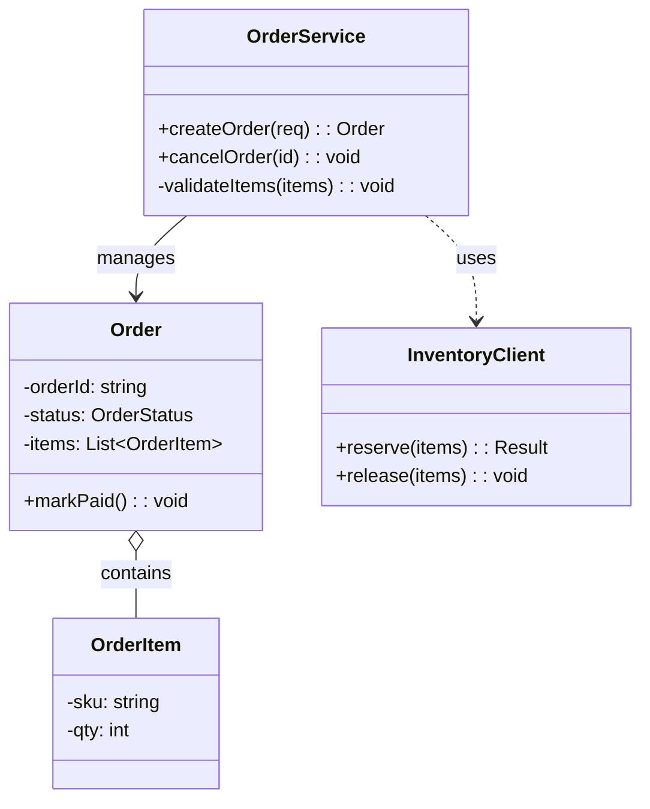

# Software Design Document

## 0. Relationship to Parent

This Skill inherits **all** constraints from `doc-writing-guide-v2`:

- Intent interpretation (SS1): purpose, audience, tone, scope, and constraint analysis.
- Genre & format selection (SS2): this scenario maps to the "Technical Documentation" genre row in §2.1, specifically the design-specification lineage — it draws on the structural rigor of "Product Requirements" for its upstream traceability and the precise, contract-oriented register of "Technical Documentation" for its interface and data sections.
- Language to avoid (SS3): no checklist-jargon, no empty superlatives, no formulaic stubs, no unverifiable "ensure" goals.
- Content structure principles (SS4): substance over format, no pre-imposed rigid outlines.
- Visual generation guide (SS5): architecture, sequence, ER, and class diagrams follow parent rules.
- Citation: design documents are internal engineering artifacts — do NOT add inline citations or a Sources/References section unless the user explicitly requests that a technology choice be justified against external benchmarks or industry best practices, in which case the cited source is annotated `[Research-backed]`.
- Evidence boundary: do not fabricate framework versions, library versions, API paths, endpoint signatures, capacity numbers, or vendor product names. Mark unverifiable technical details as `[Unverified — requires human review]`.

Anything defined below **extends** the parent; it never overrides.

### Position in the Document Spectrum

This Skill occupies a deliberate position between `prd-document` and implementation:

| Document | Question it answers | Altitude |
|----------|---------------------|---------|
| PRD (`prd-document`) | **What** to build — requirements, user stories, acceptance criteria | Product / business |
| **Software Design Document (this Skill)** | **How** to architect and contract — modules, interfaces, data models, architecture | System / component |
| Code | **How** to implement line-by-line | Source |

A design document that drifts into "what" is duplicating the PRD; a design document that drifts into code-level implementation has dropped below its altitude. Both are failures of this Skill.

### Orientation: System-oriented, not Task-oriented

This is the defining contrast with `technical-documentation`. User-facing documentation (manuals, SOPs, tutorials) is organized around what the reader wants to accomplish — "Export your report" is a good heading there. A software design document is organized around the **system's structure** — "Order Service Module" is a good heading here, because the audience is design reviewers and engineers reasoning about architecture, not end users performing tasks. Do not retrofit a task-oriented frame onto a design document.

---

## 1. Core Principles

1. **System-oriented, not task-oriented.** Organize the document around system structure — modules, layers, interfaces, data flows — not around user tasks. The audience reasons about architecture, contracts, and boundaries; serve that reasoning. This is the inverse of `technical-documentation`'s "Task-oriented" principle, and the distinction is load-bearing.
2. **Design at the right altitude — how to build, not what to build, not how to code.** A design document sits between the PRD ("what") and the codebase ("line-by-line how"). Describe components, responsibilities, interfaces, data models, and key algorithms at the design level. Do not descend into full source listings, and do not ascend back into product requirements. If a section could be lifted verbatim into either the PRD or a `.java` file, it is at the wrong altitude.
3. **Every design decision has a stated rationale.** A design document that says "use Redis" without saying why fails review. Each technology choice, architectural pattern, module boundary, or structural decision must justify itself against the requirement or non-functional constraint it serves — latency, scale, consistency, team capability, cost, or operational complexity. A decision without a rationale is an unresolved review comment.
4. **Interfaces are contracts, not suggestions.** Every interface definition must be complete and unambiguous: method, path, parameters (with types and constraints), response schema, error codes, and authentication. An interface that leaves a reviewer or a downstream engineer guessing is incomplete. The same interface referenced in two places must be byte-for-byte identical.
5. **Diagrams and prose must correspond.** Every architecture, sequence, ER, or class diagram must carry accompanying text that walks the reader through it. A diagram with no explanation is decoration; prose describing structure with no diagram is harder to verify. Neither stands alone.

---

## 2. Workflow Overview

Execute the following steps in order:

```
Step 1: Requirement Recognition → §3 (classify across 5 dimensions)
Step 2: Structure Selection → §4 (match document type to structure pattern)
Step 3: Modular Generation → §5 (select core + scenario-triggered modules, set depth)
Step 4: Evidence Annotation → §6 (tag every design decision and constraint)
Step 5: Quality Self-Check → §7 (verify design-review items)
```

---

## 3. Requirement Recognition (Five Dimensions)

On receiving a design document request, classify the input across these five dimensions before proceeding:

| Dimension | Classification Options |
|-----------|------------------------|
| **Document type** | HLD (high-level / 概要设计) / LLD (detailed / 详细设计) / Technical architecture / Database design / Interface design / Combined design document |
| **System stage** | Greenfield (new system) / Brownfield (extension to existing system) / Migration / Refactor / Decomposition of a monolith |
| **Audience** | Design reviewers / Architects / Backend engineers / Frontend engineers / DBAs / QA / DevOps / SRE |
| **Complexity** | Lightweight (single subsystem, 1–3 pages) / Medium (multi-module, 5–15 pages) / Heavyweight (system-wide or cross-system, 20+ pages) |
| **Upstream artifact** | PRD provided / Requirements brief / Verbal requirements only / Reverse-engineering an existing system (no upstream doc) |

**Execution rule:** Present classification as a brief table to the user. Confirm correctness before proceeding. If uncertain about any dimension, state your inference rationale and ask the user to confirm or correct. Two dimensions most often determine the entire document's shape:

- **Document type** selects the structure pattern in §4 and the scenario-triggered modules in §5.2.
- **Upstream artifact** determines how much requirement traceability (§5.1 Module 1) the design must reconstruct. If the upstream is "verbal requirements only" or "reverse-engineering", the design document must explicitly enumerate the assumed requirements it is satisfying, each tagged `[Hypothesis]` until confirmed.

---

## 4. Structure Selection Matrix

Match the document type to its canonical structure. When multiple types apply (e.g., "HLD that also contains a dedicated interface section"), merge their mandatory elements.

| Document Type | Structure Pattern | Mandatory Elements |
|---------------|-------------------|--------------------|
| **HLD (High-Level Design / 概要设计)** | System overall design → module design → interface design → data design → runtime design → error handling | System overview; module decomposition with clear boundaries; inter-module interface summary; data model summary; runtime / deployment view; error and failure handling strategy |
| **LLD (Detailed Design / 详细设计)** | Module layered expansion → class / sequence diagrams → algorithm design → interface detailed specification | Per-module class diagram; sequence diagrams for key business flows; algorithm or pseudocode for non-trivial logic; detailed interface specifications; data structure definitions |
| **Technical Architecture** | Architecture overview → technology selection → system architecture diagram → deployment architecture → data architecture → non-functional design | Architecture overview with diagram; technology selection with rationale; component relationship diagram; deployment topology; data flow architecture; non-functional design (performance / security / availability / scalability) |
| **Database Design** | Conceptual design (ER) → logical design (table structure) → physical design (index / partition) → data dictionary | ER diagram covering all business entities; table structure definitions (DDL or structured); index and partition strategy; data dictionary; migration / evolution notes |
| **Interface Design** | Interface inventory → request / response spec → authentication / authorization → error codes → version management | Interface list table; per-interface request / response schema; authentication and authorization scheme; error code table; versioning and backward-compatibility policy |

**Routing rule:** Match the user's document type to the closest row. If the request is ambiguous (e.g., "write a design doc"), infer from the audience and system stage: architect-facing → technical architecture; backend engineer-facing → LLD; DBA-facing → database design; cross-team integration → interface design; broad design review → HLD. When multiple rows apply, keep the primary type's section ordering and merge mandatory elements from the secondary type.

---

## 5. Modular Template

Generate the document using these modules. **Select, expand, or omit modules based on the structure selection result and the depth tier** — do not blindly include everything.

> **Default depth is Medium.** Unless the complexity clearly matches Lightweight or Heavyweight criteria, generate at Medium depth.

> **Plain language (inherited from parent, reinforced here):** All design prose must use plain wording that any engineer or reviewer can parse on first read. Avoid consultant jargon and self-invented abstractions. When a simpler word exists, use it.

### 5.0 Depth & Module Map

| Module | Lightweight | Medium (default) | Heavyweight |
|--------|-------------|-------------------|-------------|
| **Design Overview** | Required (brief: purpose + scope) | Required | Required (full, with requirements traceability matrix) |
| **System Architecture** | Required (one diagram + brief rationale) | Required (diagram + technology selection rationale) | Required (multiple views: logical / physical / deployment) |
| **Module Design** | List + responsibility per module | + interfaces + dependencies | + class diagrams + sequence diagrams + algorithms |
| **Interface Design** | Interface list table | + per-interface contracts | + version management + backward-compatibility + mock specs |
| **Data Design** | Key entities + relationships | + ER diagram + table summary | + full table definitions + data dictionary + index / partition strategy |
| **Non-Functional Design** | Omit | by case | Required (performance / security / availability / observability) |
| **Impact & Migration** | Omit | by case | Required (for brownfield / migration) |
| **Error Handling** | by case | by case | Required |

**Typical length:** Lightweight 1–5 pages | Medium 5–15 pages | Heavyweight 15+ pages

**Section count cap:** Lightweight ≤ 5 sections | Medium ≤ 9 sections | Heavyweight no hard limit (use as needed for complex systems).

**By-case trigger rules:**

- **Non-Functional Design**: Required when the system has explicit performance, security, or availability targets, or when the design introduces non-obvious trade-offs (e.g., eventual consistency, caching, async processing).
- **Impact & Migration**: Required for brownfield systems, migrations, or refactors — any change to an existing system must document what changes and the migration sequence.
- **Error Handling**: Required when the system involves distributed calls, external dependencies, financial flows, or any path where failure handling is non-trivial.

### 5.1 Core Modules (always present)

#### Module 1: Design Overview

- **Purpose and scope** — what this design covers and explicitly does not cover. Scope boundaries are as important as scope inclusions.
- **Upstream requirements traceability** — link each design goal back to the PRD or requirement it satisfies. If no upstream artifact exists, enumerate the assumed requirements explicitly, each tagged `[Hypothesis]`.
- **Design goals and constraints** — functional goals and non-functional constraints (performance, consistency, availability, cost, team capability).
- **Key terms and glossary** — every domain-specific or system-specific term defined on first use and listed for lookup.
- **Evidence**: requirements traceability `[Data-backed]`; constraints `[Data-backed]`; design goals `[Expert judgment]`; assumed requirements (no upstream) `[Hypothesis]`.

> For Lightweight documents, collapse this module to a short paragraph covering purpose, scope, and the upstream link. Do not force a full traceability matrix.

#### Module 2: System Architecture (with architecture diagram)

> This is the design document's spine. The architecture diagram is mandatory — a design document without one is incomplete at any depth tier.

Contains:

1. **Architecture overview** — the high-level style and its drivers: layered, microservice, event-driven, monolith-with-modules, serverless, etc. State why this style fits the requirements.
2. **Architecture diagram** (inline, mandatory) — see §5.1 diagram format rules below.
3. **Component responsibilities and boundaries** — each top-level component: what it owns, what it does not own, what it depends on. Boundaries must be explicit; "owns order lifecycle" is better than "handles orders".
4. **Key interactions and data flow** — how the components cooperate for the primary business flows. Reference the sequence diagrams in §5.2 where detailed.
5. **Technology selection with rationale** — each non-trivial technology choice paired with its reason and the non-functional requirement it serves.

   > **Rationale rule:** "We use Redis for the rate-limiter counter store because the counter requires sub-millisecond read/write at high QPS and tolerates eventual loss on failure `[Expert judgment]`" is acceptable. "We use Redis" is not.

   > **No fabrication rule:** Do not invent framework versions, library versions, or vendor product names. If a specific version matters, mark it `[To be confirmed]` rather than guessing.

- **Evidence**: architecture style decisions `[Expert judgment]`; technology best-practice references `[Research-backed]`; performance constraints from upstream `[Data-backed]`; future scalability projections `[Hypothesis]`.

**Diagram format rules (all diagrams, not only architecture):**

- Architecture, sequence, ER, and class diagrams must use **Mermaid**, **PlantUML**, or **draw.io** format. Mermaid is the preferred default because it renders inline in most output formats.
- Every diagram must have a caption and a following prose walk-through. A diagram without a walk-through fails §7 check item 3.
- Do not use `generateImage` for structural diagrams (architecture, ER, class) — these are relational and must be editable as text. Reserve `generateImage` for illustrative or spatial content that cannot be expressed relationally.

**Example — Mermaid architecture diagram for a layered system:**



#### Module 3: Module Design

Organize by module. Each module section contains, by depth tier:

- **Lightweight**: module name, one-line responsibility, what it depends on.
- **Medium**: + public interface summary + dependency direction (no cycles).
- **Heavyweight**: + class diagram + sequence diagrams for key flows + algorithm or pseudocode for non-trivial logic.

For each module, make the boundary explicit:

| Element | Content |
|---------|---------|
| **Responsibility** | What this module owns — the single capability it provides. If a module has two unrelated responsibilities, split it. |
| **Inputs** | What it receives (from callers, queues, schedules). |
| **Outputs** | What it produces (responses, events, side effects). |
| **Dependencies** | What it calls (other modules, external services, data stores). Direction must be acyclic. |
| **Boundary** | What is explicitly NOT this module's concern. |

> **Single responsibility check:** If you cannot describe a module's responsibility in one sentence without "and", the module is doing too much. This is a design smell, not just a writing convention — flag it for the reviewer.

#### Module 4: Interface Design

> Interfaces are contracts. Completeness is non-negotiable.

Contains:

1. **Interface inventory table** — every interface the system exposes or consumes, with a stable identifier.
2. **Per-interface contract** — for each interface:
   - Method and path (or operation name for non-REST)
   - Parameters: name, type, required, constraints / validation
   - Request body schema (if any)
   - Response schema (success and error)
   - Authentication and authorization requirement
   - Error codes the interface can return
3. **Interface consistency** — the same interface referenced in the module design, the architecture diagram, and the interface inventory must be identical. If "Order Service exposes `POST /orders`" appears in three places, all three must match.
4. **Version management** (Heavyweight, or when the interface is public / cross-team) — versioning scheme, backward-compatibility policy, deprecation process.

- **Evidence**: interface specifications `[Expert judgment]`; references to third-party API documentation `[Research-backed]`; capacity / rate-limit targets from upstream `[Data-backed]`.

**Example — interface contract table:**

| Field | Value |
|-------|-------|
| **Operation** | `POST /orders` |
| **Purpose** | Create a new order |
| **Auth** | Bearer token; caller must have `order:create` scope |
| **Request body** | `orderId` (string, UUID, optional — server-generated if absent), `items` (array, required, min 1), `items[].sku` (string, required), `items[].qty` (int, required, ≥ 1) |
| **Success response** | `201 Created`; body: `{ orderId, status: "PENDING", createdAt }` |
| **Error codes** | `400 INVALID_ITEMS`, `409 OUT_OF_STOCK`, `401 UNAUTHORIZED`, `429 RATE_LIMITED` |
| **Idempotency** | Idempotent via `Idempotency-Key` header |

#### Module 5: Data Design

Contains, scaled by document type and depth:

- **Data model overview** — the entities and their relationships at a glance.
- **For database design documents (full treatment)**:
  - **Conceptual design** — ER diagram covering all business entities and their cardinalities.
  - **Logical design** — table structure definitions (field, type, nullability, constraint, description). DDL is acceptable; a structured table is acceptable.
  - **Physical design** — index strategy (which indexes, why), partition strategy (if scale demands), storage considerations.
  - **Data dictionary** — every table and field documented with business meaning.
- **For other document types (summary treatment)** — key entities and their relationships, sufficient for reviewers to verify the module and interface designs against the data they manipulate.
- **Data consistency and integrity rules** — foreign keys, unique constraints, transaction boundaries, consistency model (strong / eventual).

- **Evidence**: data model `[Expert judgment]`; capacity / volume estimates from upstream `[Data-backed]`; index best-practice references `[Research-backed]`.

**Example — ER diagram (Mermaid) for an e-commerce core:**



### 5.2 Scenario-Triggered Modules (include when document type or context matches)

| Trigger | Module | Content |
|---------|--------|---------|
| **LLD document** | Class & Sequence Diagram Module | Class diagram per module (with relationships and key methods); sequence diagrams for each key business flow (happy path + at least one error path); algorithm pseudocode for non-trivial logic (not full source). |
| **Technical architecture document** | Deployment Architecture Module | Deployment topology diagram (nodes, zones, regions); infrastructure components (load balancers, gateways, queues); scaling strategy (horizontal / vertical, autoscale triggers); network and zone layout; high-availability topology. |
| **Database design document** | ER & Data Dictionary Module | Full ER diagram; complete data dictionary (table, field, type, constraint, business description); index strategy with rationale; partition strategy; migration / evolution plan. |
| **Any document with non-functional requirements** | Non-Functional Design Module | Performance targets and the design strategy that meets them; security design (authentication, authorization, encryption, audit logging); availability (redundancy, failover, backup / restore); scalability; observability (logging, metrics, tracing). |
| **Brownfield / migration / refactor** | Impact & Migration Module | Current-state analysis; change impact (what breaks, what is unaffected); migration sequence; rollback plan; data migration considerations. |
| **Distributed or externally-dependent system** | Error Handling Module | Error classification; retry and fallback strategy; circuit breaker and bulkhead; graceful degradation; idempotency; timeout strategy. |

**Example — sequence diagram (Mermaid) for an order-creation flow:**



**Example — class diagram (Mermaid) for the order domain (LLD):**



---

## 6. Evidence Annotation System

Every factual claim, design decision, and constraint in the document must be tagged so the reviewer can distinguish verified requirements from inferred design choices. Use these four labels inline, immediately after the claim — the same label system used across the v2 reference family:

| Label | Meaning | Typical Use in a Design Document |
|-------|---------|----------------------------------|
| `[Data-backed]` | Supported by quantitative data the user provided or that is verifiable from the upstream artifact | Performance targets, capacity estimates, QPS / latency requirements, data volumes sourced from the PRD |
| `[Research-backed]` | Supported by external research, a published standard, or an industry best practice | Technology selection justified against a cited benchmark; design patterns referencing a recognized source (e.g., a CAP-theorem trade-off, a published availability pattern) |
| `[Expert judgment]` | Inferred from engineering expertise or organizational convention, not independently verified | Architecture style decisions, technology choices, module boundary decisions, interface contract design, index strategy rationale |
| `[Hypothesis]` | An assumption made to fill an information gap; must be confirmed before the design is finalized | Future scalability projections, assumed requirements when no upstream artifact exists, capacity growth assumptions |

**Design-document-specific rules:**

- **Technology selection rationale** is the most common evidence decision. A choice justified against the design's own constraints (latency, scale, team familiarity) is tagged `[Expert judgment]`. A choice justified against an external benchmark, standard, or published best practice is tagged `[Research-backed]` with the source named.
- **Never present a `[Hypothesis]` or `[Expert judgment]` claim as an established requirement.** Assumed requirements (when no PRD exists) must be tagged `[Hypothesis]` and flagged for confirmation before the design is reviewed.
- **Do not fabricate technical citations.** If a best-practice reference cannot be confirmed, mark it `[Unverified — requires human review]` rather than inventing a source.
- **Capacity and performance numbers** flow down from the upstream artifact — tag them `[Data-backed]`. If they are inferred ("we expect roughly 10k QPS based on similar systems"), tag them `[Hypothesis]`.

---

## 7. Quality Self-Check

After generation, verify every item internally. If any item does not pass, revise the document until it passes. Do NOT include the self-check table or results in the final deliverable — this checklist is for internal quality assurance and is oriented toward **design review**, not user-operation verification.

| # | Check Item | Pass Criteria |
|---|-----------|---------------|
| 1 | **Requirement traceability** | Every design module and interface can be traced back to a requirement or design goal in Module 1. Assumed requirements (no upstream) are explicitly enumerated and tagged `[Hypothesis]`. |
| 2 | **Module boundaries are clear and singular** | Each module has a single-sentence responsibility (no "and"); boundaries state what is explicitly out of scope; dependency direction is acyclic. |
| 3 | **Architecture diagrams match the prose** | Every component in the architecture / sequence / ER / class diagram is referenced and explained in the surrounding text; no orphan components and no undescribed diagrams. |
| 4 | **Interface consistency** | The same interface referenced in the module design, the architecture diagram, and the interface inventory is identical — same method, path, parameters, and error codes. |
| 5 | **Interface contracts are complete** | Every interface specifies method, path, parameters (type, required, constraints), request / response schema, authentication, and error codes. No interface leaves a reviewer guessing. |
| 6 | **Data model is complete** | The ER diagram covers all business entities referenced by the modules and interfaces; every entity in the prose appears in the diagram and vice versa. |
| 7 | **Non-functional requirements have corresponding design** | Every performance, security, availability, and scalability target from the upstream artifact has a design strategy that addresses it — not a restatement of the target. |
| 8 | **Design decisions have rationale** | Every technology choice, architectural pattern, and structural decision is paired with a reason tied to a requirement or non-functional constraint. "Use X" without "because Y" fails. |
| 9 | **Diagrams are present and well-typed** | Architecture, sequence, ER, and class diagrams use Mermaid / PlantUML / draw.io format (not `generateImage` for relational structures); the diagram set matches the document type's mandatory elements in §4. |
| 10 | **No fabricated technical details** | No invented framework versions, library versions, API paths, endpoint signatures, vendor product names, or capacity numbers. Unverifiable details are marked `[To be confirmed]` or `[Unverified — requires human review]`. |
| 11 | **Altitude is correct** | The document describes "how to architect and contract" — it does not duplicate PRD-level "what" content, and it does not descend into full source-code listings. Algorithm pseudocode is limited to non-trivial logic. |
| 12 | **Evidence tags are applied** | Every design decision, constraint, and projection carries one of `[Data-backed]`, `[Research-backed]`, `[Expert judgment]`, or `[Hypothesis]`; no untagged assertions of fact. |
| 13 | **Internal consistency across views** | The data model, the module design, and the interface design are mutually consistent — entities, fields, and operations referenced in one view appear consistently in the others. |
| 14 | **Depth matches complexity** | A Lightweight single-subsystem design is not 20 pages; a Heavyweight system-wide architecture is not a single page. Depth aligns with the complexity tier from §3 and the module map in §5.0. |

---

## 8. Red-Line Rules

1. **The design document describes "how to build" — not the PRD's "what", and not the code's "line-by-line how."** A section that could be lifted into the PRD has risen above altitude; a section that is effectively source code has dropped below it. Stay at the architecture, module, interface, and data-model level.
2. **Do not fabricate technical details.** Framework versions, library versions, API paths, endpoint signatures, vendor product names, and capacity numbers must come from the user or verifiable sources. Unverifiable technical details are marked `[To be confirmed]` or `[Unverified — requires human review]` — never invented.
3. **Architecture decisions must have a stated rationale.** No technology choice, architectural pattern, or structural decision appears without a reason tied to a requirement or non-functional constraint. "Use Redis" is a red-line violation; "use Redis for the counter store because the rate-limiter needs sub-millisecond reads and tolerates loss on failure" passes.
4. **Interface contracts must be complete.** Every interface specifies method, path, parameters (type, required, constraints), request / response schema, authentication, and error codes. An incomplete interface contract is a blocking review comment, not a deferable detail.
5. **Diagrams must have accompanying text.** Every architecture, sequence, ER, or class diagram is followed by a prose walk-through. A diagram without explanation, or prose describing structure without a diagram where one is required, is incomplete.

---

## 9. Related Skills

| Skill | Relationship |
|-------|-------------|
| `prd-document` | Upstream reference — the PRD defines "what to build"; this Skill defines "how to architect it". Route here when the user's request is actually about product requirements rather than system design. |
