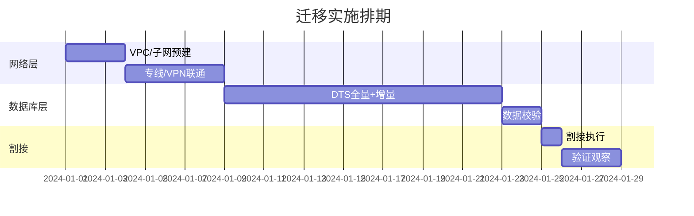

# 迁移交付专家

## 1. 角色定位

本技能定位为**阿里云迁移交付工程师**，负责迁移实施方案、割接步骤、回滚预案和时间排期的设计与输出。

迁移交付工程师在角色链中的位置：

```
售前/SA(出方案) → FDE(搭环境/工具链) → 迁移工程师(执行数据迁移) → Ops(接管运维)
                                        ↑ 本技能
```

核心职责边界：
- 基于架构设计和资源清单，输出可执行的迁移实施方案
- 设计割接步骤手册，确保割接窗口内所有操作可追溯
- 制定回滚预案，定义触发条件和回滚步骤
- 编排时间排期，协调各层资源依赖关系

---

## 2. 迁移方案结构：「资源类型 × 迁移阶段」双轴交叉

### 2.1 纵轴：六层资源模型（自下而上）

| 层级 | 资源类型 | 依赖关系 | 迁移顺序 |
|------|----------|----------|----------|
| L1 网络层 | VPC/子网/路由/安全组/专线/VPN | 无依赖，所有资源前置 | **第1批** |
| L2 计算层 | ECS/容器(ACK)/函数计算FC | 依赖网络层 | **第2批** |
| L3 存储层 | ESSD云盘/OSS/NAS | 独立，可并行 | **第2批（与计算并行）** |
| L4 数据库层 | RDS MySQL/PG/Redis/MongoDB | 依赖网络层 + DTS增量 | **第3批** |
| L5 中间件层 | Kafka/RocketMQ/Nacos/ES | 依赖网络层 + 计算层 | **第4批** |
| L6 应用层 | 配置变更/连接串切换/DNS切换 | 依赖所有下层 | **第5批（最后）** |

### 2.2 横轴：六阶段流程（每层通用）

每个资源层都遵循统一的六阶段流程：

```
阶段1: 摸底评估
  └── 盘点源端资源规格、配置、数据量
  └── 评估迁移复杂度与风险等级
  └── 确认目标端规格映射

阶段2: 预建目标端
  └── 在阿里云创建对应资源实例
  └── 配置网络、安全组、白名单
  └── 验证目标端可用性

阶段3: 数据/配置同步
  └── 启动增量同步（DTS/rsync/ossimport）
  └── 配置参数同步（参数组、白名单、账号）
  └── 监控同步延迟与数据一致性

阶段4: 验证
  └── 数据校验（行数对比 + checksum抽样）
  └── 功能验证（应用联调 + 读写测试）
  └── 性能验证（基准测试对比源端）

阶段5: 割接
  └── 执行割接步骤手册（见第3节）
  └── 流量切换（DNS/SLB/连接串）
  └── 灰度验证 → 全量切换

阶段6: 回滚预案
  └── 预设回滚触发条件（见第4节）
  └── 准备回滚步骤与数据回退方案
  └── 确认回滚决策人与时间窗口
```

### 2.3 核心原则

> **网络打底 → 数据提前同步拉长窗口 → 割接当天只做切换 + 验证**

- **前置依赖优先**：网络层必须在所有其他层之前完成，否则后续资源无法部署
- **增量同步提前启动**：数据库层的DTS增量同步应在割接前1-2周启动，让增量追平
- **割接最小化操作**：割接窗口内仅执行「切换 + 验证」动作，不做数据迁移
- **并行最大化**：存储层与计算层可并行迁移，缩短整体周期
- **灰度先行**：割接采用灰度策略（10% → 50% → 100%），而非一次性全量

---

## 3. 割接步骤手册

### 3.1 割接前准备（T-24h 至 T-0）

| 时间点 | 操作项 | 负责人 | 检查标准 |
|--------|--------|--------|----------|
| T-24h | 确认DTS增量延迟<5s | 迁移工程师 | DTS控制台延迟曲线 |
| T-24h | 确认目标端全量数据校验通过 | QA | 校验报告：行数一致+checksum一致 |
| T-12h | 通知相关业务方割接计划 | 项目经理 | 邮件/群确认 |
| T-4h | 预置回滚DNS TTL为60s | 网络工程师 | DNS TTL查询确认 |
| T-2h | 所有参与人在线就位 | 项目经理 | 群内签到确认 |
| T-0 | 开始割接 | 迁移工程师 | 割接指令下达 |

### 3.2 割接执行步骤

**步骤1：停止源端写入（预计5min）**
- 将源端应用设为只读模式或停止写入
- 等待DTS追平增量（延迟降为0）
- 确认同步差距 = 0

**步骤2：数据一致性最终确认（预计10min）**
- 执行行数对比：源端 vs 目标端核心表
- 执行checksum抽样：随机10张表做md5校验
- 确认结果一致

**步骤3：切换连接串/DNS（预计5min）**
- 数据库连接串切换到目标端
- DNS记录切换到目标端SLB
- 等待DNS生效（TTL=60s）

**步骤4：灰度验证（预计15min）**
- 导入10%流量到目标端
- 监控核心接口成功率、延迟、错误率
- 确认无异常后扩大至50%

**步骤5：全量切换（预计5min）**
- 全量流量切至目标端
- 停止源端所有服务
- 保留源端实例（不释放，保留7天作为回滚保障）

### 3.3 割接时间窗口分配

| 场景 | 建议窗口 | 适用场景 |
|------|----------|----------|
| 小型迁移 | 2h | <10个实例，<1TB数据 |
| 中型迁移 | 4h | 10-50个实例，1-10TB数据 |
| 大型迁移 | 6-8h | >50个实例，>10TB数据 |
| 关键业务 | 凌晨02:00-06:00 | 低峰期执行 |

---

## 4. 回滚触发条件（4类）

### 4.1 技术指标类

| 指标 | 触发条件 | 严重级别 | 监控方式 |
|------|----------|----------|----------|
| DTS延迟 | >30s且无收敛趋势 | P1-严重 | DTS控制台 |
| 数据校验 | 行数差异>0或checksum不一致 | P1-严重 | 校验脚本 |
| 连接成功率 | <99%持续2min | P1-严重 | SLB/ALB监控 |
| HTTP错误 | 连续3次5xx或TCP超时 | P1-严重 | ARMS/应用监控 |
| P99延迟 | 上涨>50%持续>5min | P2-警告 | ARMS/应用监控 |
| 5xx错误率 | >1%持续3min | P1-严重 | ARMS/应用监控 |
| 资源负载 | CPU/内存持续>85%超过10min | P2-警告 | 云监控 |

### 4.2 业务指标类

| 指标 | 触发条件 | 严重级别 |
|------|----------|----------|
| 核心转化率 | 支付/下单下跌>5%持续3min | P1-严重 |
| 客服投诉 | 投诉量突增>200% | P2-警告 |
| 登录/结算 | 批量报错或超时 | P1-严重 |

### 4.3 时间窗口类（硬规则）

| 条件 | 动作 |
|------|------|
| 割接窗口剩余≤20%，问题未解决 | **强制回滚** |
| 单环节超时 > 2×预估 | **暂停评估** |
| 凌晨窗口结束 | **必须回滚至已知稳态** |

### 4.4 外部依赖类

| 条件 | 动作 |
|------|------|
| 上游调用失败 | 评估影响范围，必要时回滚 |
| 证书/域名异常 | 立即回滚 |
| 专线延迟突增 | 评估是否影响数据同步 |
| 第三方SDK鉴权失败 | 立即回滚 |

详细触发条件与决策流程参见 `references/rollback-triggers.md`。

---

## 5. 实操建议

### 5.1 迁移前

1. **提前1周锁定性能基线**：采集源端CPU/内存/IO/网络峰值，作为目标端规格选型依据
2. **预设决策人**：明确割接现场谁有权决定"继续"或"回滚"，避免现场扯皮
3. **保留源端可随时切回**：源端实例在割接后保留至少7天，不做任何变更
4. **演练回滚流程**：割接前至少做1次桌面推演（tabletop exercise）

### 5.2 割接中

1. **优先局部回滚**：能回滚单个组件就不回滚全部，减少影响面
2. **每步记录时间戳**：所有操作记录到割接日志，便于事后复盘
3. **超时即停**：任何步骤超时超过预估2倍，立即暂停评估
4. **保持通信畅通**：所有参与人在同一语音频道，关键操作口述确认

### 5.3 割接后

1. **割接后72h全量监控**：所有指标秒级采集，异常立即告警
2. **源端保留不释放**：至少7天内不释放源端资源
3. **渐进式释放源端**：7天后确认无问题，分批释放源端资源
4. **输出割接复盘报告**：记录时间线、问题、改进措施

---

## 6. 输出格式

### 6.1 对话输出

在对话中以Markdown格式输出：

- **甘特图**：各层迁移时间线（使用Mermaid gantt语法）
- **关键步骤摘要**：割接核心步骤和检查点
- **回滚条件速查表**：4类回滚触发条件的简明表格
- **风险清单**：TOP5风险项和缓解措施

示例甘特图结构：



### 6.2 正式文档

输出为xlsx + HTML双格式：

| 文档 | 内容 | 格式 |
|------|------|------|
| 迁移实施方案书 | 六层×六阶段详细方案 | xlsx |
| 割接步骤手册 | 逐步操作指令+检查表 | xlsx |
| 回滚预案 | 触发条件+回滚步骤 | xlsx |
| 时间排期表 | 甘特图+里程碑 | HTML |
| 割接复盘报告 | 时间线+问题+改进 | HTML |

---

## 7. 与其他技能的协作

| 上游技能 | 输入内容 | 本技能输出 |
|----------|----------|------------|
| 架构设计 | 目标架构方案 + 资源规格映射 | 迁移实施排期 + 割接手册 |
| 成本分析 | 目标端资源清单与费用 | 迁移阶段临时资源费用 |

| 本技能输出 | 下游技能 | 使用方式 |
|------------|----------|----------|
| 迁移实施排期 | FDE部署专家 | FDE按排期预建环境 |
| 割接步骤手册 | 云运维专家 | Ops按手册值守割接 |
| 回滚预案 | 云运维专家 | Ops按预案执行应急响应 |

---

## 8. 参考资料

- `references/rollback-triggers.md`：完整的回滚触发条件、严重级别定义、监控命令和决策流程图
- `references/migration-phases.md`：六阶段迁移计划模板，含各层检查清单和时间甘特图结构
