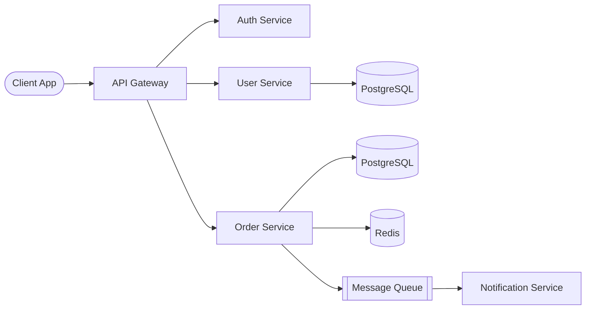
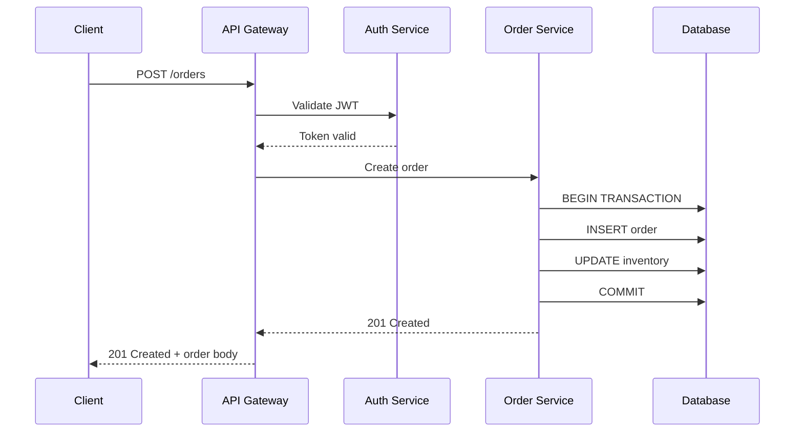
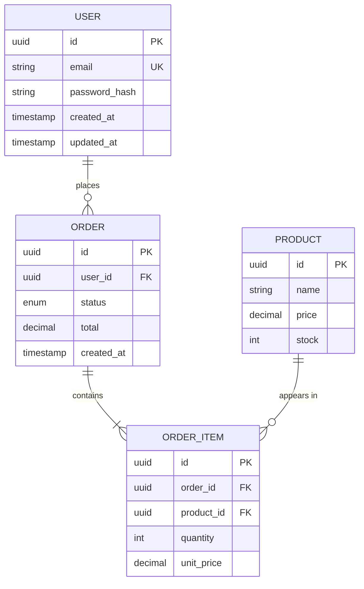
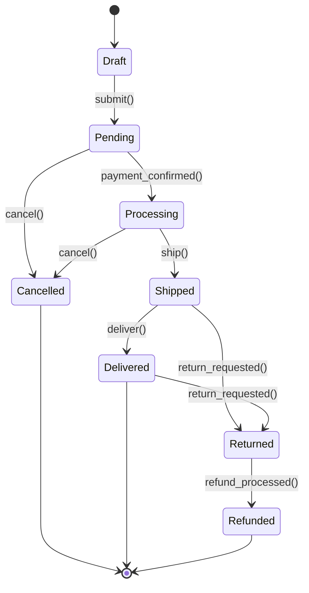
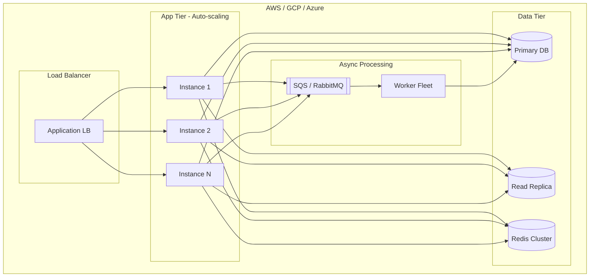
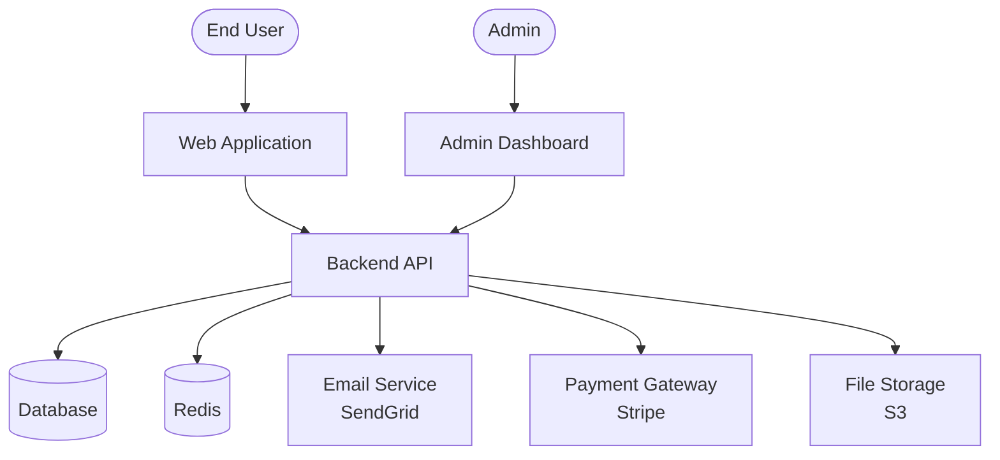

# Diagram Patterns Reference

Use these Mermaid diagram patterns when producing architecture artifacts.

---

## 1. System Overview (Flowchart)

Use for showing service boundaries and data flow.

**When to use:** High-level system topology, service maps, deployment views.

---

## 2. Request Flow (Sequence Diagram)

Use for showing step-by-step interactions between components.

**When to use:** API call flows, auth flows, multi-step processes, debugging
interaction problems.

---

## 3. Entity Relationships (ER Diagram)

Use for database schema visualization.

**When to use:** Schema design, migration planning, data model discussions.

---

## 4. State Machine

Use for modeling entity lifecycle.

**When to use:** Order workflows, user account states, approval processes,
any entity with a lifecycle.

---

## 5. Deployment / Infrastructure

**When to use:** Infrastructure discussions, scaling plans, cloud architecture.

---

## 6. C4 Context Diagram

Use for showing system context and external integrations.

**When to use:** Stakeholder presentations, system boundaries, external
dependency mapping.

---

## Tips

- Keep diagrams focused on ONE concern. Split into multiple diagrams rather
  than cramming everything into one.
- Label arrows with the protocol or action (`HTTP`, `gRPC`, `publish`, `query`).
- Use subgraphs to group related components.
- Color-code by concern when helpful: `style NodeName fill:#f96,stroke:#333`.
- For complex systems, start with a C4 Context diagram, then zoom into
  specific areas with flowcharts or sequence diagrams.
