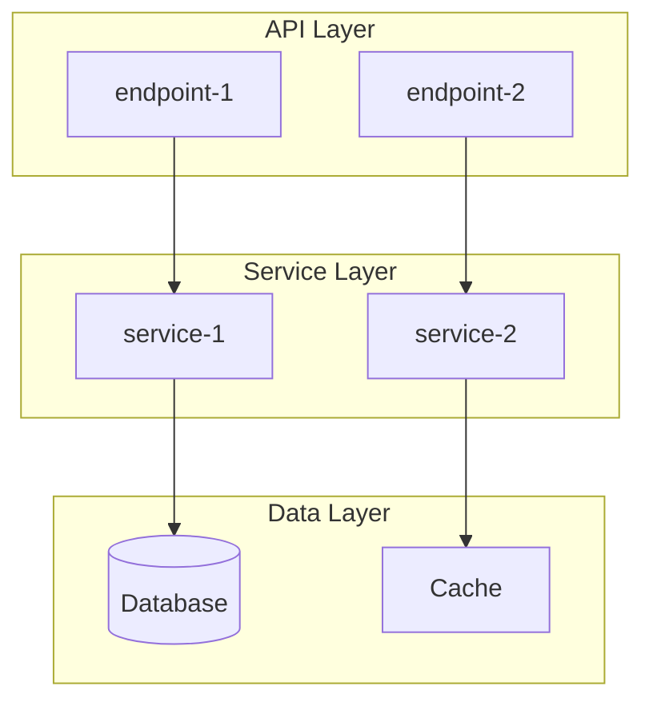
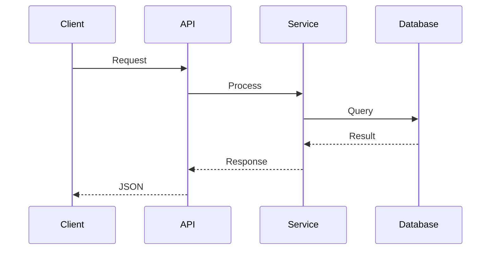

# Phase별 상세 체크리스트

## Phase 1: Surface Scan

### 메타파일 탐색 (언어별)

| 언어 | 메타파일 | 확인 항목 |
|------|---------|----------|
| TypeScript/Node | `package.json`, `tsconfig.json` | scripts, dependencies, target, strict |
| Python | `pyproject.toml`, `setup.py`, `requirements.txt` | build-system, dependencies, python-requires |
| Rust | `Cargo.toml`, `Cargo.lock` | workspace, features, edition |
| Go | `go.mod`, `go.sum` | module path, go version, requires |
| Java/Kotlin | `build.gradle`, `pom.xml` | plugins, dependencies, sourceCompatibility |

### 체크리스트

```
□ 프로젝트 이름, 버전, 라이선스
□ 주 언어 및 타겟 (ES2022, Python 3.12 등)
□ 의존성 수 (prod / dev 분리)
□ 빌드 명령어 (build, dev, start)
□ 테스트 프레임워크 (jest, pytest, cargo test)
□ 린터/포매터 (eslint, prettier, ruff)
□ Dockerfile 유무 → 배포 방식 추정
□ CI/CD 설정 (.github/workflows, .gitlab-ci.yml)
□ 엔트리포인트 파일 (main, index, app)
□ 소스 파일 수 및 총 라인 수 (wc -l 또는 cloc)
```

### Project Identity Card 템플릿

```markdown
| 항목 | 값 |
|------|-----|
| 이름 | {name} |
| 언어 | {language} ({target}) |
| 프레임워크 | {framework} |
| 빌드 | {build tool} |
| DI | {DI framework or 없음} |
| 엔트리 | {entrypoint file} |
| DB | {database} |
| 규모 | ~{N} 소스 파일, {M} 주요 서비스 |
| 테스트 | {test framework} / {coverage}% |
| 배포 | {Docker / serverless / bare metal} |
```

---

## Phase 2: Architecture Mapping

### 체크리스트

```
□ src/ 디렉토리 2단계 트리 출력
□ 레이어 식별 (API / Service / Data / Infra)
□ 모듈 간 의존 방향 (단방향인지 확인)
□ DI/IoC 컨테이너 사용 여부 (tsyringe, inversify, NestJS 등)
□ 설계 패턴 식별 (MVC, Layered, Hexagonal, CQRS 등)
□ 공유 유틸리티 / 공통 모듈 위치
□ 설정/환경변수 관리 방식
□ 로깅 시스템
```

### Mermaid 아키텍처 다이어그램 템플릿



---

## Phase 3: Core Pipeline Tracing

### 파이프라인 추적 전략

1. **엔트리포인트 찾기**: main/index 파일에서 라우터/핸들러 등록 확인
2. **미들웨어 체인**: 요청이 핸들러에 도달하기 전 거치는 단계
3. **서비스 호출**: 핸들러→서비스 계층 호출 순서
4. **데이터 접근**: 서비스→DB/캐시/외부 API 호출
5. **응답 생성**: 결과 변환 및 직렬화

### Explore 에이전트 분배 전략

| 분기 기준 | 에이전트 할당 |
|----------|-------------|
| 엔드포인트별 | 각 주요 엔드포인트에 1개씩 |
| 레이어별 | API/Service/Data 각 1개 |
| 기능별 | 코어/인증/에러처리 각 1개 |

최대 3개 병렬. 각 에이전트에게 명확한 파일 목록과 질문 제공.

### Mermaid 시퀀스 다이어그램 템플릿



---

## Phase 4: Deep Dive

### Component Card 템플릿

| 항목 | 내용 |
|------|------|
| **이름** | {ComponentName} |
| **파일** | `src/services/{file}.ts` |
| **크기** | {N}줄 / {M}KB |
| **책임** | {한 문장으로} |
| **주요 메서드** | `method1()`, `method2()` |
| **의존성** | {주입받는 서비스들} |
| **상태** | {stateless / stateful - 어떤 상태를 갖는지} |
| **에러 처리** | {try-catch / Result type / throw} |
| **패턴** | {Strategy / Factory / Singleton 등} |
| **복잡도** | {낮음/중간/높음} - 이유 |

---

## Phase 5: Dependencies & Integration

### 의존성 분류표

| 의존성 | 역할 | 유형 | 대체 가능 | 대체 후보 |
|--------|------|------|----------|----------|
| {name} | {역할} | 필수/선택 | O/X | {대안들} |

### 외부 서비스 매핑

```
□ API 호출 (REST, GraphQL, gRPC)
□ 데이터베이스 (SQL, NoSQL, 캐시)
□ 메시지 큐 (Redis, RabbitMQ, Kafka)
□ 스토리지 (S3, MinIO, 로컬 FS)
□ 인증/인가 (OAuth, JWT, API Key)
□ 모니터링 (로깅, 메트릭, 트레이싱)
□ AI/ML 서비스 (OpenAI, Anthropic 등)
```

---

## Phase 6: Security & Quality

### OWASP Top 10 체크리스트 (경량)

```
□ A01: 접근 제어 결함 — 인증/인가 로직 확인
□ A02: 암호화 실패 — 시크릿 하드코딩, 평문 전송
□ A03: 인젝션 — SQL, 명령어, XSS
□ A04: 안전하지 않은 설계 — 비즈니스 로직 결함
□ A05: 보안 설정 오류 — 기본값, 디버그 모드
□ A07: 인증 실패 — 세션 관리, 비밀번호 정책
□ A08: 데이터 무결성 — 역직렬화, CI/CD 파이프라인
□ A09: 로깅/모니터링 부족 — 감사 로그
□ A10: SSRF — 서버 측 요청 위조
```

### 기술 부채 패턴

```
□ TODO/FIXME/HACK 주석 수
□ any 타입 사용 빈도 (TypeScript)
□ 중복 코드 (비슷한 로직 반복)
□ 과도한 복잡도 (중첩 3단계 이상)
□ 미사용 코드 (dead code)
□ 테스트 커버리지 부족 영역
```

---

## Phase 7: Output Generation

### 노트 생성 체크리스트

```
□ note-writer 템플릿 준수
□ frontmatter 완성 (name, description, keywords, related, tags)
□ 요약: 프로젝트가 뭔지 + 왜 분석했는지 2-3문장
□ 쉬운 설명: 비개발자도 이해할 수 있는 비유
□ 아키텍처 다이어그램 (Mermaid) 포함
□ 데이터 플로우 다이어그램 (Mermaid) 포함
□ Component Cards 테이블
□ Dependency Map
□ references/ 하위 상세 문서 분리
□ 관련 노트 wikilink 연결
□ symlink 생성
```
