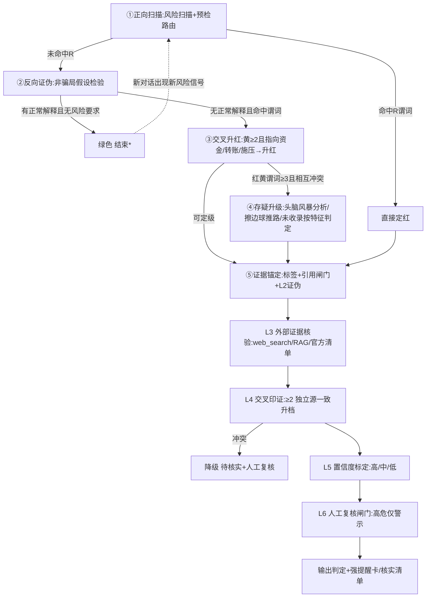

# 风险分级判定表

命中任一谓词即定级，多命中取最高级。所有谓词都是**可观察的**——从用户描述中能直接确认的事实，不依赖猜测。

## 判定辩证链（五段闭环 · 总览）

技能判定逻辑由五段辩证链构成，正向命中与反向证伪相互制衡，避免"见敏感词即判红"或"漏判叠加风险"：



> \*绿色为当前信息下的最优点，**非不可变终局**：若后续对话出现新风险信号（如开始索要钱款/验证码/转账），重新走①正向扫描，与主动守护（SKILL.md 第2步）一致。

## 红色（高危 · 确定/极大概率诈骗 · 必须强提醒卡）

| # | 可观察谓词 | 典型场景 |
|---|---|---|
| R1 | 索要验证码、支付密码、银行卡号+密码 | 冒充客服退款、冒充银行、冒充平台"核验" |
| R2 | 要求屏幕共享、远程控制、开启录屏 | 冒充公检法、冒充平台客服"指导操作" |
| R3 | 要求转账至"安全账户""监管账户" | 冒充公检法（公检法不存在安全账户） |
| R4 | 声称涉嫌犯罪/涉案，要求配合调查并保密 | 冒充公检法、冒充海关 |
| R5 | 承诺稳赚、高回报、内部渠道（刷单返利、虚拟币、荐股） | 刷单返利、虚假投资理财、杀猪盘 |
| R6 | 威胁时限："不操作就冻结/起诉/影响征信" | 冒充公检法、冒充平台客服 |
| R7 | 不明链接要求输入账号密码/个人信息 | 钓鱼链接、伪基站短信 |
| R8 | 要求下载非官方渠道 App（APK）并注册投资/刷单 | 虚假投资、刷单返利 |
| R9 | 以"解冻费""保证金""手续费""税费"为由要求先付款 | 虚假贷款、虚假投资提现 |
| R10 | 冒充熟人/领导/老板，要求紧急转账且"不方便电话" | 冒充老板、冒充熟人（财务人群高发） |
| R11 | 要求购买礼品卡/充值卡并告知卡密 | 冒充客服退款、冒充老板 |
| R12 | 假客服以"理赔""退款"为由要求开启支付软件的备用金/贷款额度 | 冒充客服退款（"备用金骗局"） |
| R13 | 宣称"治病/神奇功效/高额升值"，诱导购买高价保健品、收藏品 | 保健品/养生诈骗、收藏品骗局 |
| R14 | 诱导抵押/过户房产或大额资产 | 以房养老骗局 |
| R15 | 冒充反诈中心/官方机构，以"保护账户"为由要求转账/下载远程控制 | 冒充反诈中心 |
| R16 | 要求购买黄金/取现金，经网约车、快递、上门取件方式交付 | 虚假投资理财（规避转账拦截的新手法） |
| R17 | 承诺高额固定/静态收益（日化 1%+、月化 10%+、"稳赚不赔"），收益依赖新人资金或拉人头提成 | 资金盘（互助/拆分/分红/挖矿/众筹盘） |
| R18 | 以"0元购/消费全返/全额返款/积分全返"为噱头，商品价格虚高或需预存数倍资金 | 0元购/消费返利资金盘 |
| R19 | 以发行/交易虚拟币、稳定币、数字资产为名吸金（只涨不跌、质押生息、挖矿躺赚），或诱导下载虚假交易所/钱包 App | 虚拟币/变种币骗局 |
| R20 | 以"特招/内部名额/包过/境外高薪/保送"等名义要求缴纳"运作费/服务费/保证金"，或冒充官方诱导留学生"自导自演绑架"向家人勒索赎金，或私下换汇骗取资金 | 升学/留学/境外诈骗（高考特招、虚拟绑架、换汇） |
| R21 | 要求向个人账户/陌生账户/非对公账户转账（含扫码付款、直接提供卡号收款、"先转给朋友/财务"） | 冒充客服退款、冒充公检法、虚假投资提现等（转账即最高频风险信号） |
| R22 | 以"兼职/日结/跑分"为名要求出借银行卡、收款码、支付账户，或架设 GOIP/呼转设备换取报酬 | 跑分、帮信、"电诈工具人"（出借即涉嫌帮信罪，属于违法参与而非受骗） |

## 黄色（可疑 · 需核实 · 给核实清单）

| # | 可观察谓词 | 处置 |
|---|---|---|
| Y1 | 陌生人搭讪，诱导下载 App/加群 | 核实对方身份，不下载 |
| Y2 | 主动联系声称退款/理赔/中奖 | 通过官方渠道核实，不点链接 |
| Y3 | 兼职、刷单邀请（尚未要求垫付） | 告知刷单违法且必骗，勿投入 |
| Y4 | 熟人异常借钱/转账（身份未核实） | 电话/视频二次确认身份 |
| Y5 | 网恋对象提及投资、借款、见面路费 | 高度警惕杀猪盘，不汇款 |
| Y6 | 二手交易要求脱离平台私下交易 | 拒绝，坚持平台担保 |
| Y7 | 招聘要求先交培训费/服装费/押金 | 正规招聘不收费，拒绝 |
| Y8 | 机票/车票"退改签"短信，要求点链接或提供信息 | 通过航司官方 App/电话核实 |
| Y9 | 免费礼品/旅游/体检/讲座引流，后续推销高价产品 | 保健品会销、免费诱饵引流 |
| Y10 | 熟人/网友推荐"稳赚不赔""内测名额"项目，邀请进群听课或下载 App | 资金盘早期引流 |
| Y11 | 以"免费/超低价旅游+送大礼"为饵招揽参团，行程实为购物点/会销/讲座，或推销"旅游+理财" | 免费/低价旅游骗局 |
| Y12 | 以追星/粉丝群/直播打赏/免费福利为饵诱导未成年人操作手机、提供验证码或小额转账 | 追星/直播间打赏诈骗（未成年人高发） |

## 绿色（正常 · 低风险）

- 正常社交聊天，无转账/验证码/链接/施压要素
- 正常电商交易沟通（订单确认、物流咨询、售后协商，未要求脱离平台）
- 银行/官方机构的正常通知（仅提醒性内容，未要求提供信息或转账）
- 内容不足以定级为黄/红，且无任何风险信号（但若内容"无任何已知信号却语义明显异常/陌生"，**不自动判绿**，转「L3 未知模式兜底」主动核验，见 SKILL.md / verification-chain.md，禁止静默放过新型骗术）

## 定级注意

1. **上下文优先**：银行官方短信的"验证码提醒"是正常通知；但"把验证码告诉我"是 R1。判据是**是否要求用户提供/操作**，而非消息来源字样。
2. **多命中叠加**：R3+R4+R6 同时出现 = 冒充公检法经典三连，置信度最高。
3. **反向证伪（必做）**：定级前先做"非骗局假设检验"——该内容是否有正常解释（官方提醒性通知、真实订单/物流、正常社交）？有正常解释且无风险要求 → 绿色；无正常解释且命中风险谓词才定级。避免"看到敏感词就判红"。
4. **黄色→红色升级回路**：给出黄色核实清单后，若用户反馈核实结果确认异常（对方确为骗子、继续施压、诱导转账），立即升级为红色并输出强提醒卡；若核实无异常（官方渠道确认、对方身份属实且无风险要求），按绿色收尾并保留一句安全提醒。黄色不是终点，需跟进核实结果；跟进仅追问核实结论，最多 3 轮，用户未反馈则维持黄色提醒并提示风险仍在。**交叉升红组合清单**（黄色谓词 ≥2 且其中至少一项指向资金/转账/施压即升红，与 SKILL 第 3 步一致）：Y9免费引流 + R13/R5、Y3/Y7 + 任意施压 R6、Y1陌生人诱导下载 + R8/R7、Y10/Y11 + R5/R17。凡命中即升红，避免"黄+黄"被漏判为黄。
5. **黄色核实清单**（输出格式）：

```
【提醒】该内容存在可疑特征，建议核实：
1. {核实动作1}
2. {核实动作2}
在核实前，请不要转账、不点链接、不提供验证码。

6. **置信度标定（必做）**：定级结论的置信度不再写固定占位，按 [./verification-chain.md] 的 L5 rubric 量化——红 + R≥2 或 [已核验-假]→高（"极大概率"）；红 + 单 R 无核验→高（"很可能"，标 [推断]）；黄 + [已核验-真]→中可降级；黄无核验→中（"可疑，待核实"）；绿 + 反向证伪通过→低（"低风险"）；内部判定与外部核验冲突或 [核验未达]→标 [待核实]，不标定高低。严禁"一定/绝对/百分之百"。

## 擦边球/灰色地带判定推路（合法性区分）

> 目的：把"游走合规边缘、令人不适但未必违法"的擦边球讨论（如合法高压力销售、持牌理财推销、真实但高价产品、合法直销）与"真违法诈骗"明确区分，避免技能因"不舒服/高压话术"就误判红色。

**定义**：擦边球 = 有真实交易主体、有真实商品/服务交付、有合规信息披露，但话术高压、定价偏高或营销方式引人不适的内容。与真违法诈骗的核心区别不在"话术难不难受"，而在是否命中**违法诈骗硬指标**。

**五步判定推路**（决策树，SKILL.md 第3步引用本段）：

1. **反向证伪（定级注意第3条）**：有合法/正常解释且无风险要求 → 绿色（当前信息下最优点，非不可变终局；若后续对话出现新风险信号如开始索要钱款/验证码/转账，重新走①正向扫描，与主动守护一致）。
2. **查违法诈骗硬指标（R 谓词）**：是否命中任一明确指向"虚构事实/冒充/非法占有"的 R 谓词——R3 安全账户、R10 冒充领导/熟人紧急转账、R16 买黄金/现金实物交付规避拦截、R22 出借卡帮信、R1 索要验证码/密码、R2 远程控制转走资金、R8 非官方投资 App、R19 假交易所/虚拟币吸金等。**命中任一即红色，不是擦边球**——"对方有公司"不能覆盖 R 硬指标。
3. **查主体真实性**：对方是否有可核实的真实主体（持牌机构、可查工商信息的真实公司）？无真实主体/无法核实 → 黄色（可疑需核实）；有真实主体 → 进入第 4 步。
4. **查收益与交付来源**：
   - 承诺收益来自真实经营/投资且有风险披露 → 即使话术高压/高价，落**黄色（擦边球）**，不下"违法"结论；
   - 收益来自新人资金/拉人头（R17 资金盘）或虚构项目（R5+R8 杀猪盘）→ 红色；
   - 有真实商品交付（非金字塔拉人头）→ 黄色或绿色，依定价合理性。
5. **结论分层**：
   - 有真实主体 + 真实交付 + 合规披露 + 仅话术高压/高价 → **黄色（擦边球，提示核实，禁定性违法）**；
   - 仅命中 Y 谓词且无 R 硬指标 → 黄色；
   - 命中 R 硬指标 → 红色（真诈骗）；
   - 无任何风险要素 → 绿色。

**红线（擦边球场景）**：黄色/绿色场景下**禁止**输出"这是诈骗""对方是骗子""你被骗了"等定性结论；只给核实清单与风险提示。是否违法交由监管/司法认定，技能止步于风险提示，不代位定性。

**与未收录推理的衔接**：擦边球且无法归入 36 类 → 仍可走"未收录，按特征判定 [推断]"，但仅命中 Y 谓词时应优先判黄并提示核实，而非编造类型名或升红。
```