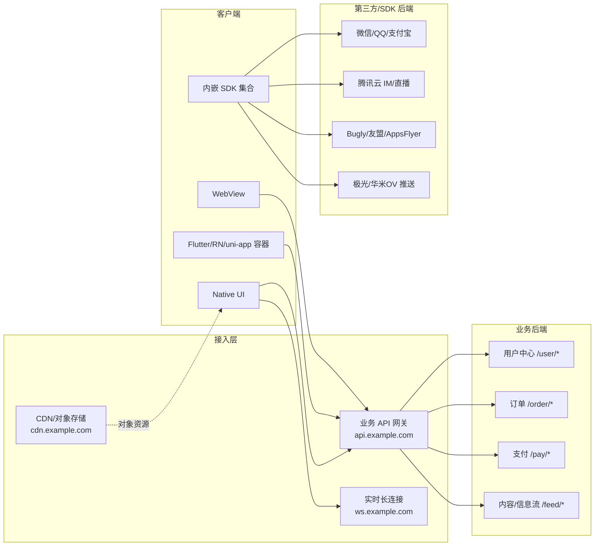
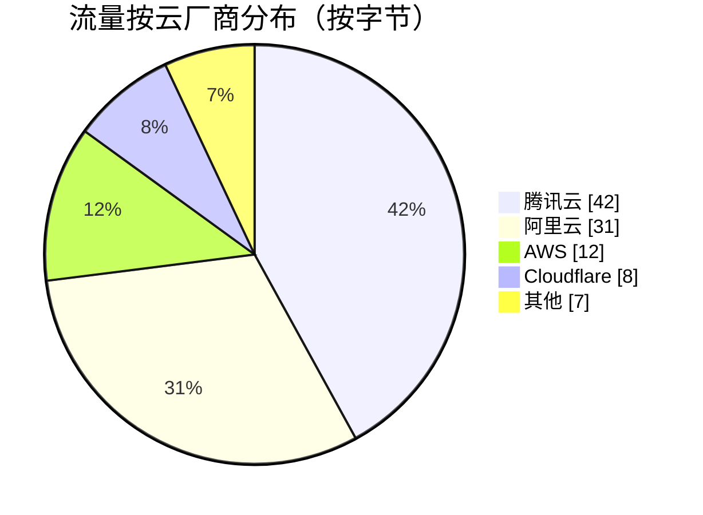

# APP 架构图模板

最终架构图分四层，使用 mermaid `graph LR` 或 `flowchart`：

```
[终端层] → [接入/网关层] → [业务后端 (按域名/路径聚类)] → [基础设施 (云厂商/CDN/SDK后端)]
```

## 模板 1：通用四层



## 模板 2：云资源分布（饼图，HAR 流量字节占比）



## 模板 3：SDK 调用桑基（功能 → 厂商）

```mermaid
sankey-beta
登录,微信,30
登录,QQ,15
推送,信鸽,40
推送,极光,20
统计,友盟,50
广告,优量汇,25
直播,腾讯云,35
```

## 自动生成规则（build_arch_diagram.py 的输出口径）

1. **终端层**：固定 4 个节点（Native / 跨端框架 / WebView / SDK 集合）；跨端框架按 `sdks.json` 是否包含 `flutter/react/uni`/Cordova 决定是否显示
2. **接入层**：从 HAR 取请求最多的前 3 个一级域名，按命名习惯打标签（`api.*`/`ws.*`/`cdn.*`/`oss.*`/`img.*`）
3. **业务后端**：在主域名下按 path 第一段聚类（`/user`、`/order` …），列出 Top 8
4. **第三方**：合并 sdks.json 中 `category in {推送,统计,广告,IM,直播,支付,登录}` 的厂商
5. **边权**：用请求次数或字节数（HAR 里 `bytesIn+bytesOut`）作为标签
