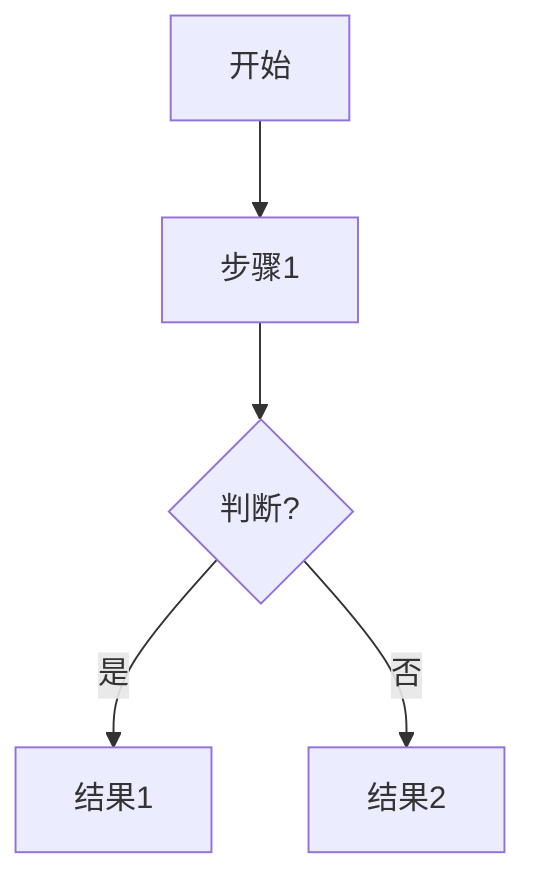

# Markdown to Flowchart

把 Markdown 文档转换为 Mermaid 流程图，生成简洁清晰的可视化内容。

## 使用方式

1. **读取用户提供的 Markdown 文件**
2. **分析文档结构**，识别：
   - 章节层级 (H1/H2/H3)
   - 步骤顺序 (数字编号、步骤词)
   - 条件分支 (如果/否则、是否)
   - 依赖关系 (需要、先要)
   - 并行流程 (同时)
3. **生成 Mermaid 流程图代码**，包括：
   - `flowchart TD/LR/BT/RL` 主流程图
   - 节点使用中文描述
   - 清晰的连线关系
   - 条件判断使用菱形
4. **输出为 .md 文件**，包含 Mermaid 代码块

## 输出格式

```markdown
# 文档标题 流程图


```

## 生成原则

- **简洁优先**：提取核心内容，跳过细枝末节
- **清晰可读**：节点名称用中文，不超过 20 字
- **逻辑完整**：包含顺序、分支、循环、依赖、并行关系
- **格式适配**：根据文档类型选择合适的图表形式（流程图、架构图、状态图等）
- **可选补充**：常用命令速查、端口汇总、配置项等实用信息

## 示例

- 部署文档 → 部署流程图
- API 文档 → 接口调用流程图
- 运维手册 → 故障排查流程图
- README → 项目结构图
- 教程文档 → 学习路径图
- 架构设计 → 系统架构图
- 项目管理 → 任务流程图
- 任何 Markdown 文档 → 可视化流程图