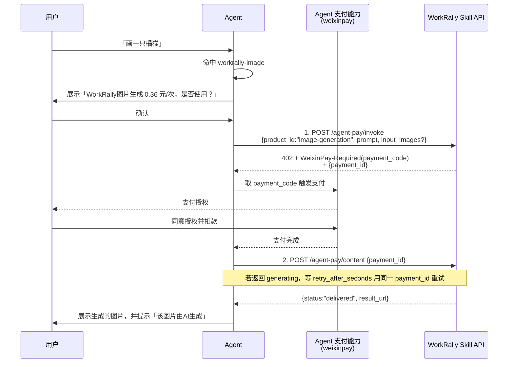

# 调用流程与字段说明

本文档帮助 AI Agent 正确调用 WorkRally 图片生成 Skill 的两个云端 API（`invoke` / `content`），完成"发起 → 支付 → 取结果"。

---

## 1. 交互流程

> Agent 只需对接 `invoke` 和 `content` 两个 API；中间的下单、支付、生成等由云端处理，Agent 无需关心。

---

## 2. invoke 入参

`POST https://workrally.qq.com/zenstudio/api/agent-pay/invoke`

| 字段 | 必填 | 说明 |
|------|------|------|
| `product_id` | ✅ | 本 Skill 固定传 `image-generation`，见 [pricing.md](pricing.md) |
| `prompt` | ✅ | 用户的画面描述（中文/英文均可），≤500 字 |
| `aspect_ratio` | ❌ | 默认 `16:9`；可选 `1:1` / `9:16` 等 |
| `input_images` | ❌ | 图生图/参考图：本地图片以 `data:image/<ext>;base64,<...>` 内联（云端自动上传）；也可传 WorkRally 产出的短链（如 `result_url`）。纯文生图省略 |

> 分辨率为 1K，由云端统一设定，调用方无需指定模型。

## 3. invoke 响应（HTTP 402）

| 位置 | 字段 | 说明 |
|------|------|------|
| Header | `WeixinPay-Required` | `payment_code`（一次性支付凭证，直接交给支付能力） |
| Body | `payment_id` | 串联本次请求的唯一 ID（后续 `content` 用它） |
| Body | `WeixinPay.WeixinPay-Required` | Header 的冗余备份（兼容只读 body 的 Agent） |
| Body | `WeixinPay.prompt` | 给 Agent 的引导文案 |

## 4. content 入参 / 响应

`POST https://workrally.qq.com/zenstudio/api/agent-pay/content`，入参 `{ "payment_id": "<invoke 返回的同一值>" }`。

`content` 是**异步状态机**：HTTP 200 不代表已出结果，必须读 body 的 `status` 字段判断。

| 响应 status | HTTP | body 关键字段 | 含义 | Agent 行为 |
|------|------|------|------|-----------|
| `delivered` | 200 | `result_url` | 已生成 | 展示 `result_url`，提示「该图片由AI生成」，并尽量引导 Agent 下载到本地 |
| `generating` | 200 | `retry_after_seconds`（=5） | 已支付、生成中，尚无结果 | **不是错误**：等待 `retry_after_seconds` 秒后用**同一** `payment_id` 重试 `content`，不要重新 invoke、不重复扣费 |
| `refunded` | 200 | `refund_amount_fen` / `refunded_at` | 已自动退款的终态 | 告知用户已退款；需结果则重新走 invoke |
| `failed` | 502（首次）/ 200（回放） | `code` / `msg` / `refund_status` | 生成失败，将自动退款 | 展示 `msg`，告知失败将退款；需结果则重新走 invoke（不可复用旧 `payment_id`） |
| —（用户未支付） | 402 | `code:"NOT_PAID"` / `trade_state` | 尚未支付，**body 无 `status` 字段，用 `code` 判断** | 提示用户先完成支付授权，稍后用同一 `payment_id` 重试 |
| —（已过期） | 410 | `code:"PAYMENT_EXPIRED"` / `status:"expired"` | payment_id 过期（>15min）或订单关闭 | 引导用户重新走 invoke（旧 `payment_id` 不可复用） |

> HTTP 200 + body `generating` 是「生成中」而非错误。完整错误码、HTTP 码与重试规则见 [troubleshooting.md](troubleshooting.md)。
